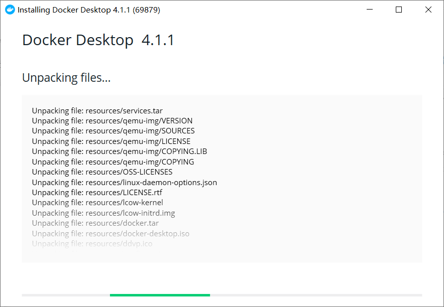
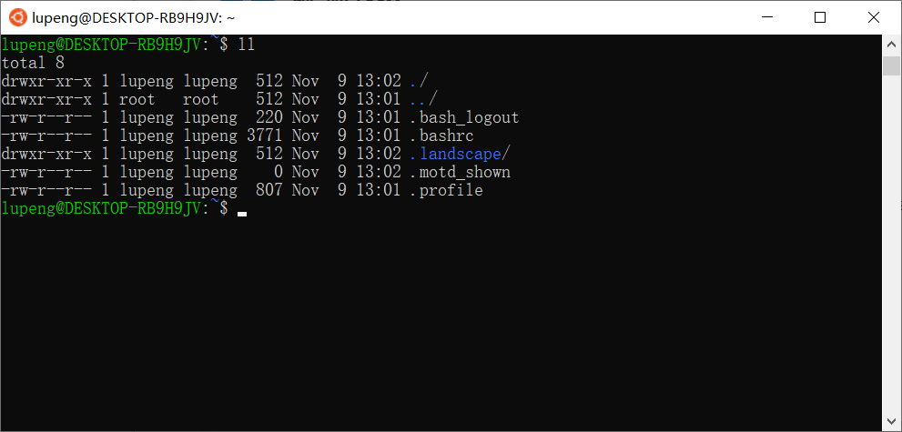
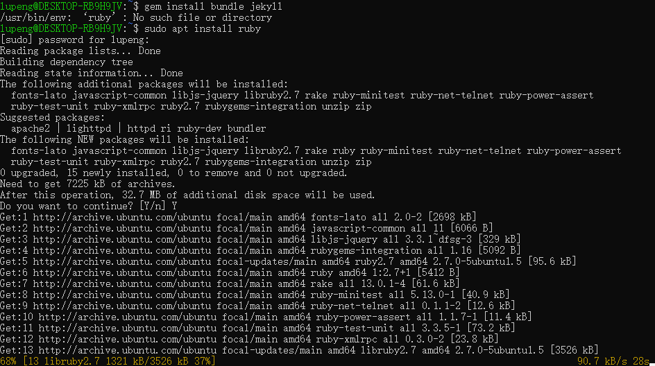
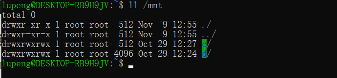

### Docker for windows

官网下载地址：[Docker Desktop for Mac and Windows | Docker](https://www.docker.com/products/docker-desktop)

安装界面：

### Windows 10 安装 docker

安装 Ubuntu

#### 安装 ruby

安装 ruby 的命令： `sudo apt install ruby`

安装 `gem install bundler jekyll`，安装完成，进入项目目录

Ubuntu 中访问 windows 目录

Windows 的盘挂载在 /mnt 目W录下

参考：

- [Windows 10 安装 Docker for Windows - 晓晨Master - 博客园](https://www.cnblogs.com/stulzq/p/7743667.html)

### Linux

查看 Linux 内核版本

- cat /proc/version
- uname -a

查看 Linux 发行版

- cat /etc/issue

- lsb_release -a

