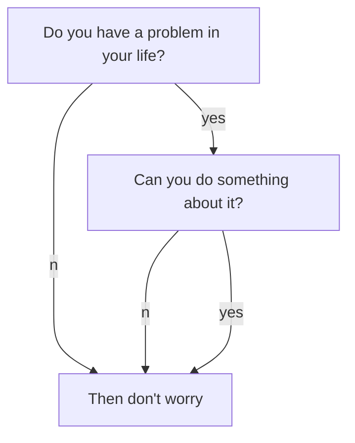

## Mathjax

When $$a \ne 0$$, there are two solutions to $$ax^2 + bx + c = 0$$ and they are

$$x_1 = {-b + \sqrt{b^2-4ac} \over 2a}$$

$$x_2 = {-b - \sqrt{b^2-4ac} \over 2a} \notag$$

**markdown:**

```tex
When $$a \ne 0$$, there are two solutions to $$ax^2 + bx + c = 0$$ and they are
$$x_1 = {-b + \sqrt{b^2-4ac} \over 2a}$$
$$x_2 = {-b - \sqrt{b^2-4ac} \over 2a} \notag$$
```

**After MathJax is enabled**, you can set `mathjax_autoNumber: true` to have equations be numbered automatically. You can use \notag or \nonumber to prevent individual equations from being numbered.
{:.info}


## Image Sizes

| Type | Class Names |
| ---- | ---- |
| **base**  | image |
| **size**  | image\-\-md (default), image\-\-xs, image\-\-sm, image\-\-lg, image\-\-xl |

### Extreme Small


```html

```

### Small


```html

```

### Middle


```html

```

### Large


```html

```

### Extreme Large


```html

```

## Image Borders

| Class Names |
| ---- |
| **border** |
| **shadow** |
| **rounded** |
| **circle** |

### Border

<div class="grid-containre">
<div class="grid grid--p-2">
<div class="cell cell--12 cell--md-4 " markdown="1">
{:.border}
</div>
<div class="cell cell--12 cell--md-auto" markdown="1">
    {:.border}
</div>
</div>
</div>

### Shadow

<div class="grid-containre">
<div class="grid grid--p-2">
<div class="cell cell--12 cell--md-4 " markdown="1">
{:.shadow}
</div>
<div class="cell cell--12 cell--md-auto" markdown="1">
    {:.shadow}
</div>
</div>
</div>

### Rounded

<div class="grid-containre">
<div class="grid grid--p-2">
<div class="cell cell--12 cell--md-4 " markdown="1">
{:.rounded}
</div>
<div class="cell cell--12 cell--md-auto" markdown="1">
    {:.rounded}
</div>
</div>
</div>

### Circle

<div class="grid-containre">
<div class="grid grid--p-2">
<div class="cell cell--12 cell--md-4 " markdown="1">
{:.circle}
</div>
<div class="cell cell--12 cell--md-auto" markdown="1">
    {:.circle}
</div>
</div>
</div>

### Mixture

<div class="grid-containre">
<div class="grid grid--p-2">
<div class="cell cell--12 cell--md-4 " markdown="1">
{:.border.rounded}
</div>
<div class="cell cell--12 cell--md-auto" markdown="1">
    {:.border.rounded}
</div>
</div>
</div>

## Alert

| Class Names |
| ---- |
| **success** |
| **info** |
| **warning** |
| **error** |

Success Text.
{:.success}

Info Text.
{:.info}

Warning Text.
{:.warning}

Error Text.
{:.error}

**markdown:**

    Success Text.
    {:.success}
^
    Info Text.
    {:.info}
^
    Warning Text.
    {:.warning}
^
    Error Text.
    {:.error}

## Tag

| Class Names |
| ---- |
| **success** |
| **info** |
| **warning** |
| **error** |

`success`{:.success}

`info`{:.info}

`warning`{:.warning}

`error`{:.error}

**markdown:**

    `success`{:.success}
^
    `info`{:.info}
^
    `warning`{:.warning}
^
    `error`{:.error}


## Youtube

<div></div>




**markdown:**

```
<div></div>
```



## Mermaid



**markdown:**

    ```mermaid
    graph TB;
        A[Do you have a problem in your life?]
        B[Then don't worry]
        C[Can you do something about it?]
        A--no-->B;
        A--yes-->C;
        C--no-->B;
        C--yes-->B;
    ```

[Mermaid](https://mermaidjs.github.io/) supports 3 kinds of diagram:

- [Flowchart](https://mermaidjs.github.io/flowchart.html)

- [Sequence Diagram](https://mermaidjs.github.io/sequenceDiagram.html)

- [Gant Diagram](https://mermaidjs.github.io/gantt.html)

## Chart

```chart
{
  "type": "line",
  "data": {
    "labels": [
      "January",
      "February",
      "March",
      "April",
      "May",
      "June",
      "July"
    ],
    "datasets": [
      {
        "label": "# of bugs",
        "fill": false,
        "lineTension": 0.1,
        "backgroundColor": "rgba(75,192,192,0.4)",
        "borderColor": "rgba(75,192,192,1)",
        "borderCapStyle": "butt",
        "borderDash": [],
        "borderDashOffset": 0,
        "borderJoinStyle": "miter",
        "pointBorderColor": "rgba(75,192,192,1)",
        "pointBackgroundColor": "#fff",
        "pointBorderWidth": 1,
        "pointHoverRadius": 5,
        "pointHoverBackgroundColor": "rgba(75,192,192,1)",
        "pointHoverBorderColor": "rgba(220,220,220,1)",
        "pointHoverBorderWidth": 2,
        "pointRadius": 1,
        "pointHitRadius": 10,
        "data": [
          65,
          59,
          80,
          81,
          56,
          55,
          40
        ],
        "spanGaps": false
      }
    ]
  },
  "options": {}
}
```

**markdown:**

    ```chart
    {
      "type": "polarArea",
      "data": {
        "datasets": [
          {
            "data": [
              11,
              16,
              7,
              3,
              14
            ],
            "backgroundColor": [
              "#FF6384",
              "#4BC0C0",
              "#FFCE56",
              "#E7E9ED",
              "#36A2EB"
            ],
            "label": "My dataset"
          }
        ],
        "labels": [
          "Red",
          "Green",
          "Yellow",
          "Grey",
          "Blue"
        ]
      },
      "options": {}
    }
    ```
