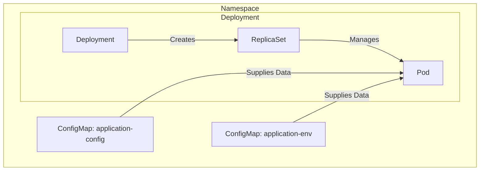

While preparing for EX280 I learned a lot about using the CLI to configure Openshift resources. It's always great learning to configure this stuff from the CLI because it gives you so much power and (In my opinion) a lot more understanding about how things work because you need to viluazie what you are doing in your head. Also: "Writing is thinking" (Ahrens2017)[^Ahrens2017]

[^Ahrens2017]: Ahrens, Sönke. _How to Take Smart Notes: One Simple Technique to Boost Writing, Learning and Thinking: For Students, Academics and Nonfiction Book Writers_. North Charleston, SC: CreateSpace, 2017.

FYI; This blog is written for OpenShift but for most command's `oc` and `kubectl` are interchangeable. 

# Understanding ConfigMaps and Secrets
In Kubernetes you can create ConfigMaps and Secrets to supply your pod's with "information". ConfigMaps and Secret's look a lot alike with the major difference at this point being that Secrets encode (not encrypt) their values in `base64`

In this blog I'll talk about creating ConfigMap's and how to mount and use them. The command's for secrets look a lot like these but I'll save that for some other time.

# Adding data to a pod using a ConfigMap
In this example we will supply a ENV key called "api_url" to a deployment. We will also add a webserver config file to the deployment.

This will look like this:



# Preparing the environment
So, if not clear already, you can do this on you own cluster or local K3s setup. We will use the `bintami/nginx` image as Deployment because it's nice and easy

## Creating the deployment
For this we will create a a new project and deploy the application with:
```bash
$ oc new-project configmaps-demo
$ oc new-app --name super-app --docker-image bitnami/nginx
```

This should resolve in a running nginx container called super-app:
```bash
$ oc get pods
NAME                         READY   STATUS    RESTARTS   AGE
super-app-67b7c69cfb-v5rr7   1/1     Running   0          8
```

## Creating the ConfigMap's
We will create 2 config maps for this example:
- **application-env** containing `api_url=https://api.amazing.com`
- **application-config** containing our simple `string` "I am your config"

We will create the application-env ConfigMap form the CLI with:
```bash
$ oc create configmap application-env \
  --from-literal api_url=https://api.amazing.com
```

And we will create the application-config ConfigMap from a simple file containing some `string` data:
```bash
$ echo "I am your config" > config.txt
$ oc create configmap application-config \
  --from-file config.txt
```

# Adding config maps using the CLI
Now for the magic 🎩. We will add both config maps to our app super-app using the `oc` command line. 

## Adding the ConfigMap as ENV variables
You do this with the following command:
```bash
$ oc set env deployment/super-app \
  --from configmap/application-env
```

This will provide the KeyPair as values to the container. There a two ways to see the results. 
1. Check the pod spec with
    ```bash
    $ oc get pods
    NAME                         READY   STATUS    RESTARTS   AGE
    super-app-67b7c69cfb-v5rr7   1/1     Running   0          8
    ```
    
    ```bash
    $ oc get pod super-app-67b7c69cfb-v5rr7 -o yaml | grep -A 4 -e 'env:'
    - env:
      - name: API_URL
        valueFrom:
          configMapKeyRef:
            key: api_url
    ```
2. Connect to the pod and echo the ENV variables
    ```bash
    $ oc get pods
    NAME                         READY   STATUS    RESTARTS   AGE
    super-app-67b7c69cfb-v5rr7   1/1     Running   0          8
    ```
  
    ```bash
    $ oc rsh super-app-67b7c69cfb-v5rr7 bash
    (pod) $ echo $API_URL
          https://api.amazing.com
    ```

## Adding the ConfigMap as file
This is done with a slightly longer command. The following wil create a volume for the pod to mount and acces the files:

> ⚠️ When mounting a volume to a pod all data on the mount path will be made inaccessible. This means that any files present at `/mount/config/application-config` will not show up in your pod

```bash
$ oc set volume deployment/super-app \
  --add \
  --type configmap \
  --mount-path /mount/config/application-config \
  --configmap-name application-config
```

This will map the ConfigMap to our pod using the new Volume. We can see the result by connecting to the pod:
```bash
$ oc get pods
NAME                         READY   STATUS              RESTARTS   AGE
super-app-67b7c69cfb-v5rr7   1/1     Running             0          7m8s
```

```bash
$ oc rsh super-app-67b7c69cfb-v5rr7 bash
```

No we can `cat` the mounted file:
```bash
(pod) $ cat /mount/config/application-config/config.txt
      I am your config
```

We can also see this mount in the `yaml` of our pod:
```bash
$ oc get pods
NAME                         READY   STATUS    RESTARTS   AGE
super-app-79fc5bf5df-zsjlg   1/1     Running   0          12m
```

```bash
$ oc get pods super-app-79fc5bf5df-zsjlg -o yaml | grep mountPath -A 2
    - mountPath: /mount/config/application-config
      name: volume-qcxd4
    - mountPath: /var/run/secrets/kubernetes.io/serviceaccount
      name: kube-api-access-wddx2
      readOnly: true
```

### ConfigMaps and multible keys
Please note that the config is being mounted as `config.txt`. This is because when we created the ConfigMap from file we did not asigne the contents of the file to a key. When you `oc describe` the config map you can see that the contents has been "keyed" to `config.txt`:
```bash
$ oc describe configmaps application-config
Name:         application-config
Namespace:    configmaps-demo
Labels:       <none>
Annotations:  <none>

Data
====
config.txt:
----
I am your config 
```

If we wanted to mount multible files we could add more key value pairs to a single config map like:
```bash
$ echo "I am your users" > users.txt
$ echo "I am your list" > list.txt
```

```bash
$ oc create configmap application-config-multible \
  --from-file config.txt \
  --from-file users.txt \
  --from-file list.txt 
```

```bash
$ oc describe configmap application-config-multible
Name:         application-config-multible
Namespace:    configmaps-demo
Labels:       <none>
Annotations:  <none>

Data
====
config.txt:
----
I am your config

list.txt:
----
I am your list

users.txt:
----
I am your users

Events:  <none> 
```

And mount it to the pod (on a different path):
```bash
$ oc set volume deployment/super-app \
  --add \
  --type configmap \
  --mount-path /mount/config/application-config-multible \
  --configmap-name application-config-multible
```

Now from the pod you'll see the files mounted to `/mount/config/application-config-multible`:
```bash
(pod) $ ls -la /mount/config/application-config-multible
total 0
drwxrwsrwx. 3 root 1000150000 110 Jan 11 09:40 .
drwxr-xr-x. 3 root root        41 Jan 11 09:40 ..
drwxr-sr-x. 2 root 1000150000  57 Jan 11 09:40 ..2022_01_11_09_40_51.324279541
lrwxrwxrwx. 1 root root        31 Jan 11 09:40 ..data -> ..2022_01_11_09_40_51.324279541
lrwxrwxrwx. 1 root root        17 Jan 11 09:40 config.txt -> ..data/config.txt
lrwxrwxrwx. 1 root root        15 Jan 11 09:40 list.txt -> ..data/list.txt
lrwxrwxrwx. 1 root root        16 Jan 11 09:40 users.txt -> ..data/users.txt
```

# Wrapping up

So that's it for now. As you can see we can use ConfigMap's to supply pods with different kinds of information. We can add ENV data and provide files to the pods using a ConfigMap. You can use almost the same commands to add the data using Secrets but ~~I'll cover that in another blog~~ you can read about that here [https://blog.benstein.nl/posts/create-and-use-secrets-openshift/](https://blog.benstein.nl/posts/create-and-use-secrets-openshift/).
