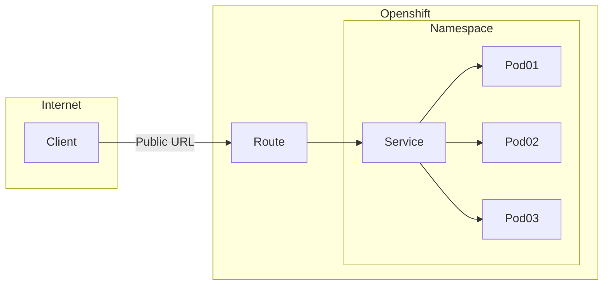

This blog will go in to ["Configure networking components"](https://www.redhat.com/en/services/training/ex280-red-hat-certified-specialist-in-openshift-administration-exam?section=Objectives) objective of the [EX280](https://www.redhat.com/en/services/training/ex280-red-hat-certified-specialist-in-openshift-administration-exam?section=Overview) exam from RedHat. In this post we will:

- Have a look at services
- Expose a service with a URL
- Check out the types of routes we can create
- Creating a route to a service that is encrypted with SSL

As always. We will be doing all the examples in a CRC ([Code Ready Containers](https://developers.redhat.com/products/codeready-containers/overview)) environment.

# Understanding services
Lets start with the last component when connecting to an application that is running in OpenShift, the `pod` where the application is running. How does it get here? When you create a application using `oc new-app` the cluster automatically creates a `service` for you (checkout `oc explain service`).

A `service` acts as a load balancer for your pod(s) running your application. This way, no matter how many pods you have running (or where they are running) there is a single service object that can be used to access them.



## Services in detail
A service {object} in Openshift can look like this:

```yaml
apiVersion: v1
kind: Service
metadata:
  annotations:
    openshift.io/generated-by: OpenShiftNewApp
  labels:
    app: nginx
    app.kubernetes.io/component: nginx
    app.kubernetes.io/instance: nginx
  name: nginx
spec:
  clusterIP: 10.217.4.22
  clusterIPs:
  - 10.217.4.22
  internalTrafficPolicy: Cluster
  ipFamilies:
  - IPv4
  ipFamilyPolicy: SingleStack
  ports:
  - name: 8080-tcp
    port: 8080
    protocol: TCP
    targetPort: 8080
  - name: 8443-tcp
    port: 8443
    protocol: TCP
    targetPort: 8443
  selector:
    deployment: nginx
  sessionAffinity: None
  type: ClusterIP
status:
  loadBalancer: {}
```

In this example we can see:
- That the cluster ip of this service (the IP that can be used to reach the pods) is `10.217.4.22`
- That this route will send traffic to deployments with a `selector` (`deployment: nginx`)
- The type of this service is `ClusterIP`. This is the default. There are more types, check them out at the [Kubernetes Service Types](https://kubernetes.io/docs/concepts/services-networking/service/#publishing-services-service-types) page

# Understanding Routes
We can access the pods using a service with an IP. Great, but no one (hopefully) is typing IP's in to their browser on a daily basis to get to your app. That's where `routes` come in to play.
With a route we can expose our service with a http URL like `amazing-app.ourcluster.com`. And if we configure Openshift even further we can make things available on base domains like `amazing-app.com`.
Routes are used by the central cluster ingress (the point where all the traffic comes in) to route (pun!) the traffic to the right service.

## `expose` vs `route`
There are two (2) ways to create a route. `oc expose` and `oc create route`. When we talk about creating a route we often jump to the latter because it has 'route' in it's name. It is even the one we should be using because `oc create route` is used to create Secure routes. And here lies the difference in the two. When using `expose` we can expose our service in a number of different ways which include using a `http` hostname. When using `oc create route` we can create a secure route that uses TLS/SSL to encrypt the traffic.

## Types of secure routes
When using `oc create route` we have to choose between a set of different types of routes, these are:
- **Edge:** This will expose a route on the *edge* of your cluster. The route will contain the SSL certificate files. Once the traffic goes to the service it will no longe be encrypted
- **Passtrough:** This will connect you pod directly to the cluster Ingress. The SSL certificate will be stored in the pod
- **Reencrypt**: Is a combination of Edge and Passtrough. It will re encrypt the traffic once it is passed the Ingress

# Exposing an application
We will now move on to some examples, we will:
1. Create a route using `expose` to create our route on `http`
2. We will create a safe edge route using a SSL certificate

> You can find instructions on how to create a Self Signed Certificate [here](https://access.redhat.com/documentation/en-us/red_hat_enterprise_linux/4/html/system_administration_guide/apache_http_secure_server_configuration-creating_a_self_signed_certificate) 
{: .prompt-tip }


## Creating a route
We will create a route called `unsecure-route` on our app called `unsecure-app` in the namespace: `this-is-insecure`. The route will be `insecure-app-this-is-insecure.apps-crc.testing` because we are on CRC. Let's get started:

Creating a project and a simple app:
```bash
$ oc new-project this-is-insecure
$ oc new-app --name insecure-app --image bitnami/nginx
--> Found container image 2309fdc (15 hours old) from Docker Hub for "bitnami/nginx"

    * An image stream tag will be created as "insecure-app:latest" that will track this image

--> Creating resources ...
    imagestream.image.openshift.io "insecure-app" created
    deployment.apps "insecure-app" created
    service "insecure-app" created
--> Success
    Application is not exposed. You can expose services to the outside world by executing one or more of the commands below:
     'oc expose service/insecure-app'
    Run 'oc status' to view your app.
```

Creating our route using `expose`:
```bash
$  oc expose service/insecure-app \
  --name unsecure-route \
  --hostname insecure-app-this-is-insecure.apps-crc.testing
route.route.openshift.io/unsecure-route expos 
```

### Testing our route
Testing can be done by spinning up another container or using the `oc debug` command:
```bash
$ oc debug insecure-app-7d8667f64b-cvkcz
(pod) $ curl -v insecure-app-this-is-insecure.apps-crc.testing
      ....
      < HTTP/1.1 200 OK
      < server: nginx
      < date: Sat, 26 Feb 2022 15:20:53 GMT
      < content-type: text/html
      < content-length: 615
      < last-modified: Tue, 15 Feb 2022 23:05:56 GMT
      < etag: "620c31d4-267"
      < x-frame-options: SAMEORIGIN
      < accept-ranges: bytes
      < set-cookie: cef860fd45f3b8c73246fd4b31240250=22b324be48072691fec3f3ebe83c8473; path=/; HttpOnly
      < cache-control: private
      ....
```

And that's that!

## Creating a secure route
Now we will create a route but we will secure it with a TLS/SSL cert. The route will be called `secure-route` with the hostname `secure-app-this-is-secure.apps-crc.testing` in our project `this-is-secure` with the app `secure-app`:

Creating a project and app:
```bash
$ oc new-project this-is-secure
$ oc new-app --name secure-app --image bitnami/nginx
```

Now we will create the secure route:
```bash
$ oc create route edge secure-route \
  --service secure-app \
  --hostname secure-app-this-is-secure.apps-crc.testing \
  --key secure-app.key \
  --cert secure-app.crt 
```

### Testing our secure route
Let's check it using `oc debug PODNAME`, don't forget to add the `-v` (verbose) and `-k` (insecure) flag's to the `curl` command otherwise you will not see the protocol and it will throw up an error because the SSL certificate is not signed by a valid CA:

```bash
$ oc debug secure-app-bccd9557b-s2nd4
(pod) $ curl -vk https://secure-app-this-is-secure.apps-crc.testing
      *  SSL certificate verify result: self signed certificate (18), continuing anyway.
      > GET / HTTP/1.1
      > Host: secure-app-this-is-secure.apps-crc.testing
      > User-Agent: curl/7.64.0
      > Accept: */*
      >
      * TLSv1.3 (IN), TLS handshake, Newsession Ticket (4):
      * TLSv1.3 (IN), TLS handshake, Newsession Ticket (4):
      * old SSL session ID is stale, removing
      < HTTP/1.1 200 OK
      < server: nginx
      < date: Sat, 26 Feb 2022 15:29:16 GMT
      < content-type: text/html
      < content-length: 615
      < last-modified: Tue, 15 Feb 2022 23:05:56 GMT
      < etag: "620c31d4-267"
      < x-frame-options: SAMEORIGIN
      < accept-ranges: bytes
      < set-cookie: 0e799158437fe6ddd46e0e7a82dd3c25=25f02ff58528846c979c113d77ea289e; path=/; HttpOnly; Secure; SameSite=None
      < cache-control: private
.... 
```

# Wrapping up
The way that services and routes play together is a fundamental building block of exposing your applications to the outside world in a safe way. The thing that I found so confusing is that `oc expose` creates routes just like `oc create route` but in the insecure way. 

I hope this post has helped you. Check out my other EX280 related content on my [EX280 page](https://blog.benstein.nl/ex280/)