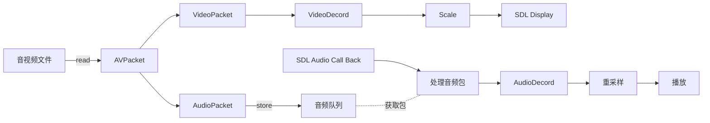

## 前言
年初进入一家音视频的公司，而在这方面感觉太菜，于是决定学习相关的知识。从零实现一个播放器我觉得是一个入门的好办法，于是参考了这个 [ffmpeg-video-player](https://github.com/rambodrahmani/ffmpeg-video-player)，跟着其中的 `tutorial` 从简单到复杂。

完成这个 `tutorial` 系列，再去深入研究 `FFMpeg` 的 `ffplay` 播放器就相对简单许多(当然 `ijkplayer` 也不在话下(:逃))。

## 开始
首先研究 [tutorial03](https://github.com/rambodrahmani/ffmpeg-video-player/tree/master/tutorial03)。
### FFMpeg 的一些初始化

#### 1、创建 AVFormatContext

```c
AVFormatContext * pFormatCtx = NULL;
ret = avformat_open_input(&pFormatCtx, argv[1], NULL, NULL);
if (ret < 0)
{
    printf("Could not open file %s.\n", argv[1]);
    return -1;
}

// read packets of a media file to get stream information
ret = avformat_find_stream_info(pFormatCtx, NULL);
if (ret < 0)
{
    printf("Could not find stream information %s.\n", argv[1]);
    return -1;
}

// print detailed information about the input or output format
av_dump_format(pFormatCtx, 0, argv[1], 0);
```
主要是读取音视频文件(`I/O context`)，然后打印音视频文件的一些信息

#### 2、找到音频或者视频的索引

```c
int videoStream = -1;
int audioStream = -1;

// loop through the streams that have been found
for (int i = 0; i < pFormatCtx->nb_streams; i++)
{
    // look for video stream
    if (pFormatCtx->streams[i]->codecpar->codec_type == AVMEDIA_TYPE_VIDEO && videoStream < 0)
    {
        videoStream = i;
    }

    // look for audio stream
    if (pFormatCtx->streams[i]->codecpar->codec_type == AVMEDIA_TYPE_AUDIO && audioStream < 0)
    {
        audioStream = i;
    }
}

// return with error in case no video stream was found
if (videoStream == -1)
{
    printf("Could not find video stream.\n");
    return -1;
}

// return with error in case no audio stream was found
if (audioStream == -1)
{
    printf("Could not find audio stream.\n");
    return -1;
}
```
#### 3、生成音频解码上下文


首先找到音频解码器

```c
// 找到一个音频解码器
const AVCodec * aCodec = NULL;
aCodec = avcodec_find_decoder(pFormatCtx->streams[audioStream]->codecpar->codec_id);
if (aCodec == NULL)
{
    printf("Unsupported codec!\n");
    return -1;
}
```

生成音频解码上下文 `context`

```c
// 生成音频解码上下文
AVCodecContext * aCodecCtx = NULL;
aCodecCtx = avcodec_alloc_context3(aCodec);
ret = avcodec_parameters_to_context(aCodecCtx, pFormatCtx->streams[audioStream]->codecpar);
if (ret != 0)
{
    printf("Could not copy codec context.\n");
    return -1;
}
```
#### 4、配置 SDL Audio 音频参数

```c
    // audio specs containers
    SDL_AudioSpec wanted_specs;
    SDL_AudioSpec specs;

    // set audio settings from codec info
    wanted_specs.freq       = aCodecCtx->sample_rate; // 采样率
    wanted_specs.format     = AUDIO_S16SYS;           // 音频格式
    wanted_specs.channels   = aCodecCtx->channels;    // 声道
    wanted_specs.silence    = 0;                      // 静音
    wanted_specs.samples    = SDL_AUDIO_BUFFER_SIZE;  // 一帧里面有多少个样本
    wanted_specs.callback   = audio_callback;         // 音频数据回调
    wanted_specs.userdata   = aCodecCtx;              // 传递的参数
    
    // Uint32 audio device id
    SDL_AudioDeviceID audioDeviceID;

    // open audio device
    audioDeviceID = SDL_OpenAudioDevice(    // [1]
                          NULL,
                          0,
                          &wanted_specs,
                          &specs,
                          SDL_AUDIO_ALLOW_FORMAT_CHANGE
                      );

    // SDL_OpenAudioDevice returns a valid device ID that is > 0 on success or 0 on failure
    if (audioDeviceID == 0)
    {
        printf("Failed to open audio device: %s.\n", SDL_GetError());
        return -1;
    }
```
这里面的几个概念：`采样率`、`音频格式`、`声道`、`样本(samples)` 要了解清楚。

#### 5、打开音频上下文(重要)

```c
// initialize the audio AVCodecContext to use the given audio AVCodec
ret = avcodec_open2(aCodecCtx, aCodec, NULL);
if (ret < 0)
{
    printf("Could not open audio codec.\n");
    return -1;
}
```
#### 6、视频解码器以及上下文

这个和音频的处理一样

```c
// retrieve video codec
const AVCodec * pCodec = NULL;
pCodec = avcodec_find_decoder(pFormatCtx->streams[videoStream]->codecpar->codec_id);
if (pCodec == NULL)
{
    printf("Unsupported codec!\n");
    return -1;
}

// retrieve video codec context
AVCodecContext * pCodecCtx = NULL;
pCodecCtx = avcodec_alloc_context3(pCodec);
ret = avcodec_parameters_to_context(pCodecCtx, pFormatCtx->streams[videoStream]->codecpar);
if (ret != 0)
{
    printf("Could not copy codec context.\n");
    return -1;
}

// initialize the video AVCodecContext to use the given video AVCodec
ret = avcodec_open2(pCodecCtx, pCodec, NULL);
if (ret < 0)
{
    printf("Could not open codec.\n");
    return -1;
}
```
### 视频处理部分
我们使用 `av_read_frame` 函数不断的读取每一个 `AVPacket` 包(这是还没解码的数据)，简单来说就是下面这样：

```c
while (av_read_frame(pFormatCtx, pPacket) >= 0) {
    // video stream found
    if (pPacket->stream_index == videoStream)
    {
        // do something
    } 
    else if (pPacket->stream_index == audioStream)
    {
            // audio stream found
            // do something
    }
}
```
#### 解码
向解码器发送一个 `AVPacket` 包，然后获取解码后的视频帧

```c
// 向解码器发送一个 AVPacket 包
ret = avcodec_send_packet(pCodecCtx, pPacket);
if (ret < 0)
{
    printf("Error sending packet for decoding.\n");
    return -1;
}

while (ret >= 0)
{
    // 获取解码后的视频帧
    ret = avcodec_receive_frame(pCodecCtx, pFrame);
    
    /*
        0: 将会成功返回视频解码帧
        AVERROR(EAGAIN): 现在无法获取解码后的视频帧，需要再送一个 Packet 包
        AVERROR_EOF: 已经到文件末尾了
        其它：解码错误
        */
    if (ret == AVERROR(EAGAIN) || ret == AVERROR_EOF)   // [3]
    {
        break;
    }
    else if (ret < 0)
    {
        printf("Error while decoding.\n");
        return -1;
    }
    // 后续的处理 ...
}
```
#### 视频帧的缩放
`SwsContext` 的初始化

```c
struct SwsContext * sws_ctx = NULL;
sws_ctx = sws_getContext(
    pCodecCtx->width,   // 源图像的宽
    pCodecCtx->height,  // 源图像的高
    pCodecCtx->pix_fmt, // 源图像的像素格式
    pCodecCtx->width,   // 目标图像的宽
    pCodecCtx->height,  // 目标图像的高
    AV_PIX_FMT_YUV420P, // 目标图像的像素格式
    SWS_BILINEAR,       // 选择缩放算法(只有当输入输出图像大小不同时有效),一般选择SWS_FAST_BILINEAR
    NULL,               // 输入图像的滤波器信息, 若不需要传NULL
    NULL,               // 输出图像的滤波器信息, 若不需要传NULL
    NULL                // 特定缩放算法需要的参数(?)，默认为NULL
);
```
这里有几篇文章可以帮助理解它使用：

[sws_getContext() 使用](https://blog.csdn.net/davidsguo008/article/details/72537832)

[FFmpeg源代码简单分析：libswscale的sws_getContext()](https://blog.csdn.net/leixiaohua1020/article/details/44305697?spm=1001.2101.3001.6650.2&utm_medium=distribute.pc_relevant.none-task-blog-2%7Edefault%7EESLANDING%7Edefault-2-44305697-blog-72537832.pc_relevant_multi_platform_whitelistv4eslandingctr2&depth_1-utm_source=distribute.pc_relevant.none-task-blog-2%7Edefault%7EESLANDING%7Edefault-2-44305697-blog-72537832.pc_relevant_multi_platform_whitelistv4eslandingctr2&utm_relevant_index=3)

[sws_getContext函数参数介绍](https://www.cnblogs.com/nanqiang/p/10116518.html)

使用 `sws_scale`:

```c
sws_scale(
    sws_ctx,                                
    (uint8_t const * const *)pFrame->data,
    pFrame->linesize,
    0,
    pCodecCtx->height,
    pict->data,
    pict->linesize
);

/*
1、参数 SwsContext *c， 转换格式的上下文。也就是 sws_getContext 函数返回的结果。
2、参数 const uint8_t *const srcSlice[], 输入图像的每个颜色通道的数据指针。其实就是解码后的AVFrame中的data[]数组。因为不同像素的存储格式不同，所以srcSlice[]维数
也有可能不同。

以YUV420P为例，它是planar格式，它的内存中的排布如下：
YYYYYYYY UUUU VVVV
使用FFmpeg解码后存储在AVFrame的data[]数组中时：
data[0]——-Y分量, Y1, Y2, Y3, Y4, Y5, Y6, Y7, Y8……
data[1]——-U分量, U1, U2, U3, U4……
data[2]——-V分量, V1, V2, V3, V4……
linesize[]数组中保存的是对应通道的数据宽度 ，
linesize[0]——-Y分量的宽度
linesize[1]——-U分量的宽度
linesize[2]——-V分量的宽度

而RGB24，它是packed格式，它在data[]数组中则只有一维，它在存储方式如下：
data[0]: R1, G1, B1, R2, G2, B2, R3, G3, B3, R4, G4, B4……
这里要特别注意，linesize[0]的值并不一定等于图片的宽度，有时候为了对齐各解码器的CPU，实际尺寸会大于图片的宽度，这点在我们编程时（比如OpengGL硬件转换/渲染）要特别注意，否则解码出来的图像会异常。

3、参数const int srcStride[]，输入图像的每个颜色通道的跨度。也就是每个通道的行字节数，对应的是解码后的AVFrame中的linesize[]数组。根据它可以确立下一行的起始位置，不过stride和width不一定相同，这是因为：
a.由于数据帧存储的对齐，有可能会向每行后面增加一些填充字节这样 stride = width + N；
b.packet色彩空间下，每个像素几个通道数据混合在一起，例如RGB24，每个像素3字节连续存放，因此下一行的位置需要跳过3*width字节。

4、参数int srcSliceY, int srcSliceH,定义在输入图像上处理区域，srcSliceY是起始位置，srcSliceH是处理多少行。如果srcSliceY=0，srcSliceH=height，表示一次性处理完整个图像。这种设置是为了多线程并行，例如可以创建两个线程，第一个线程处理 [0, h/2-1]行，第二个线程处理 [h/2, h-1]行。并行处理加快速度。

5、参数uint8_t *const dst[], const int dstStride[]定义输出图像信息（输出的每个颜色通道数据指针，每个颜色通道行字节数）
*/
```

[ffmepg中sws_scale() 函数解析](https://blog.csdn.net/yaojinjian1995/article/details/118105883)

#### SDL 渲染
这个比较简单：

```c
// the area of the texture to be updated
SDL_Rect rect;
rect.x = 0;
rect.y = 0;
rect.w = pCodecCtx->width;
rect.h = pCodecCtx->height;

// update the texture with the new pixel data
SDL_UpdateYUVTexture(
    texture,
    &rect,
    pict->data[0],
    pict->linesize[0],
    pict->data[1],
    pict->linesize[1],
    pict->data[2],
    pict->linesize[2]
);

// clear the current rendering target with the drawing color
SDL_RenderClear(renderer);

// copy a portion of the texture to the current rendering target
SDL_RenderCopy(renderer, texture, NULL, NULL);

// update the screen with any rendering performed since the previous call
SDL_RenderPresent(renderer);

```

### 音频处理部分
由于音频播放是由系统回调，所以在获取到音频数据包 `AVPacket` 之后需要立即存储起来以便播放时使用。所以需要一个队列把这些音频包暂时存储起来。

关于队列部分，这里先略过去。

#### 音频解码
我们之前注册的音频回调函数 `audio_callback`，音频解码部分在这里处理：

```c
static void audio_callback(void * userdata, Uint8 * stream, int len) {

}
```
我们从音频队列中获取数据包之后，就送到音频解码器去解码，这点和视频的解码是一样的：

```c
for (;;)
{
    while (audio_pkt_size > 0)
    {
        int got_frame = 0;
        int ret = avcodec_receive_frame(aCodecCtx, avFrame);
        if (ret == 0)
        {
            got_frame = 1;
        }
        
        if (ret == AVERROR(EAGAIN))
        {
            ret = 0;
        }
        
        if (ret == 0) {
            ret = avcodec_send_packet(aCodecCtx, avPacket);
        }
        
        if (ret == AVERROR(EAGAIN))
        {
            ret = 0;
        }
        else if (ret < 0)
        {
            printf("avcodec_receive_frame error");
            return -1;
        }
        else
        {
            len1 = avPacket->size;
        }
        
        if (len1 < 0)
        {
            // if error, skip frame
            audio_pkt_size = 0;
            break;
        }
        
        audio_pkt_data += len1;
        audio_pkt_size -= len1;
        data_size = 0;
        
        if (got_frame)
        {
            // audio resampling
            // do something
        }
        if (data_size <= 0)
        {
            // no data yet, get more frames
            continue;
        }
        // we have the data, return it and come back for more later
        return data_size;
    }
    
    if (avPacket->data)
    {
        // wipe the packet
        av_packet_unref(avPacket);
    }
    
    // get more audio AVPacket
    int ret = packet_queue_get(&audioq, avPacket, 1);
    
    // if packet_queue_get returns < 0, the global quit flag was set
    if (ret < 0)
    {
        return -1;
    }
    
    audio_pkt_data = avPacket->data;
    audio_pkt_size = avPacket->size;
}
```

#### 重采样
什么是重采样？

通俗的讲，重采样就是改变音频的采样率、sample format(采样格式)、声道数(channel)等参数，使之按照我们期望的参数输出。
{:.info}

为什么要重采样

因为当原有的音频参数不满足我们实际要求时，比如说在FFmpeg解码音频的时候，不同的音源有不同的格式和采样率等，所以在解码后的数据中的这些参数也会不一致(最新的FFmpeg解码音频后，音频格式为AV_SAMPLE_FMT_TLTP);如果我们接下来需要使用解码后的音频数据做其它操作的话，然而这些参数的不一致会导致有很多额外工作，此时直接对其进行重采样的话，获取我们制定的音频参数，就会方便很多。
再比如说，在将音频进行SDL播放的时候，因为当前的SDL2.0不支持plannar格式，也不支持浮点型的，而最新的FFpemg会将音频解码为AV_SAMPLE_FMT_FLTP，这个时候进行对它重采样的话，就可以在SDL2.0上进行播放这个音频了。
{:.info}

我们使用 `SwrContext` 进行重采样并设置相应的参数

```c
    SwrContext * swr_ctx = swr_alloc();
        // 原音频采样的声道数
    av_opt_set_int(   // 3
        swr_ctx,
        "in_channel_layout",
        in_channel_layout,
        0
    );
    
    // 原音频的采样率
    av_opt_set_int(
        swr_ctx,
        "in_sample_rate",
        audio_decode_ctx->sample_rate,
        0
    );
    
    // 原音频的采样格式
    av_opt_set_sample_fmt(
        swr_ctx,
        "in_sample_fmt",
        audio_decode_ctx->sample_fmt,
        0
    );
    
    // 重采样音频的声道数
    av_opt_set_int(
        swr_ctx,
        "out_channel_layout",
        out_channel_layout,
        0
    );
    
    // 重采样音频的采样率
    av_opt_set_int(
        swr_ctx,
        "out_sample_rate",
        out_sample_rate,
        0
    );
    
    // 重采样音频的输出格式
    av_opt_set_sample_fmt(
        swr_ctx,
        "out_sample_fmt",
        out_sample_fmt,
        0
    );
    // 初始化
    ret = swr_init(swr_ctx);
```

分配重采样的音频的空间：

```c
    int out_linesize = 0;
    uint8_t ** resampled_data = NULL;

    ret = av_samples_alloc_array_and_samples(
            &resampled_data, /// 重采样分配内存空间
            &out_linesize,   /// 采样个数的最大大小字节空间
            out_nb_channels,
            out_nb_samples,
            out_sample_fmt,
            0
        );
```
但是这里要注意 `音频延迟` 的问题

转码的过程中 , 输入 10 个数据 , 并不一定都能处理完毕并输出 10 个数据 , 可能处理输出了 8 个数据
还剩余 2 个数据没有处理。那么在下一次处理的时候 , 需要将上次没有处理完的两个数据处理了 ;
如果不处理上次的2个数据 , 那么数据会一直积压 , 如果积压数据过多 , 最终造成很大的延迟 , 甚至崩溃
因此每次处理的时候 , 都要尝试将上次剩余没有处理的数据加入到本次处理的数据中。如果计算出的 delay 一直等于 0 , 说明没有积压数据
{:.info}

```c
// 计算音频延迟
int64_t delay = swr_get_delay(swrContext , avFrame->sample_rate);

/*
    将 a 个数据 , 由 c 采样率转换成 b 采样率后 , 返回多少数据
    int64_t av_rescale_rnd(int64_t a, int64_t b, int64_t c, enum AVRounding rnd) av_const;
    下面的方法时将 avFrame->nb_samples 个数据 , 由 avFrame->sample_rate 采样率转为 44100 采样率
    返回的数据个数
    AV_ROUND_UP : 向上取整
 */

// 计算输出样本个数
int64_t out_count = av_rescale_rnd(
        avFrame->nb_samples + delay, //本次要处理的数据个数
        44100,
        avFrame->sample_rate ,
        AV_ROUND_UP );
```


音频重采样：

```c
/*
 int swr_convert(
        struct SwrContext *s,   //上下文
        uint8_t **out,          //输出的缓冲区 ( 需要计算 )
        int out_count,          //输出的缓冲区最大可接受的样本个数 ( 需要计算 )
        const uint8_t **in ,    //输入的数据
        int in_count);          //输入的样本个数
返回值 : 转换后的采样个数 , 是样本个数 , 每个样本是 16 位 , 两个字节 ;
        samples_out_count 是每个通道的样本数 , samples_out_count * 2 是立体声双声道样本个数
        samples_out_count * 2 * 2 是字节个数
 */

ret = swr_convert(
            swr_ctx,
            resampled_data,
            out_nb_samples,
            (const uint8_t **) decoded_audio_frame->data,
            decoded_audio_frame->nb_samples
        );

// 计算输出样本的字节数
resampled_data_size = av_samples_get_buffer_size(
                            &out_linesize,
                            out_nb_channels,
                            ret,
                            out_sample_fmt,
                            1
                        );
```
## 流程图




## 参考

[ffmpeg-video-player](https://github.com/rambodrahmani/ffmpeg-video-player)

[音频延迟](https://blog.csdn.net/shulianghan/article/details/104871223/?utm_medium=distribute.pc_relevant.none-task-blog-2~default~baidujs_baidulandingword~default-4--blog-83818443.pc_relevant_default&spm=1001.2101.3001.4242.3&utm_relevant_index=7)