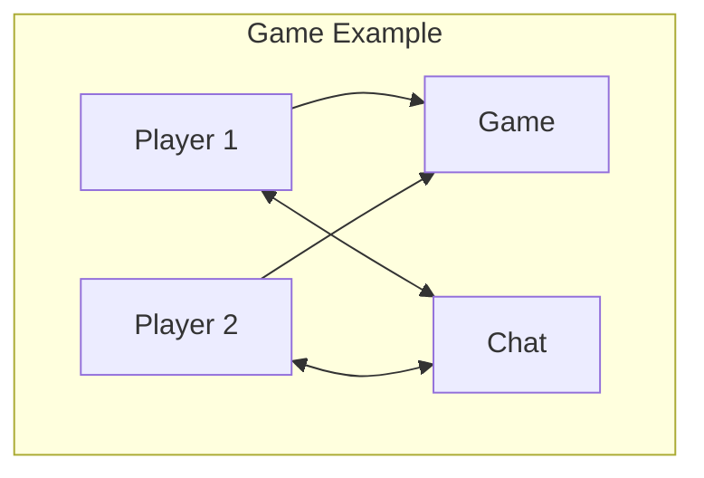
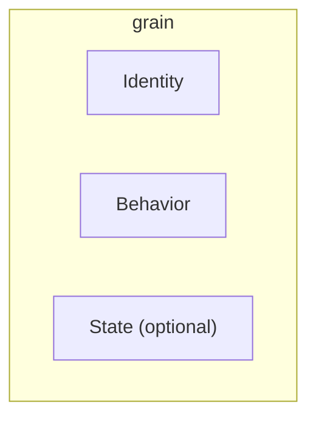
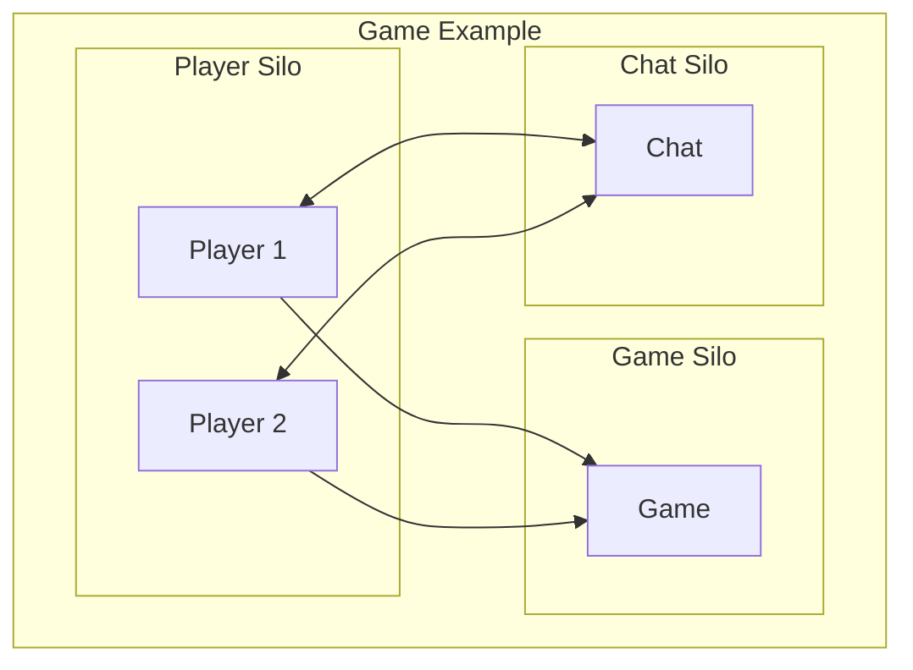
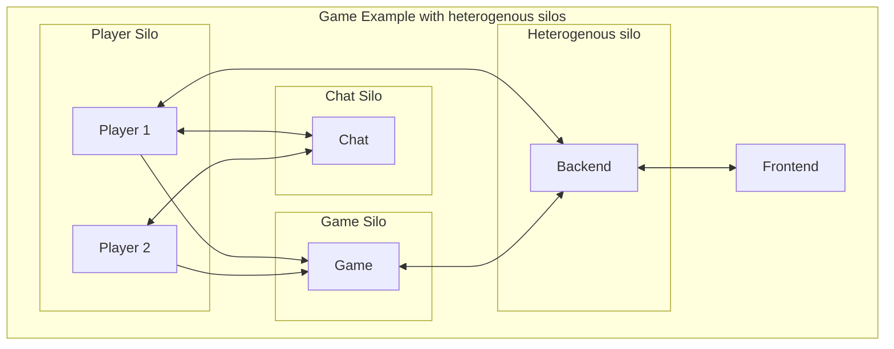

During VisugXL, there was a talk about Orleans. This is the summary of my notes during that talk.

<!--more-->

## What is Orleans?

Orleans is Microsoft's implementation of the actor model. 
It is also called a `Virtual Actor Model`, because we can always reach all actors defined in the system.
If the actor is not loaded in memory yet, Orleans will spin it up for us.

When an actor is not used for a long time, it will be deactivated by the garbage collector.

## Definitions

### Actor Model

>The actor model is a programming model in which each actor is a lightweight, concurrent, immutable object that encapsulates a piece of state and corresponding behavior. 

[Microsoft learn][1]

Let's look into a simple example. Suppose that we want to create a small game with 2 players, and a chat functionality. In the actor model, we can represent this game with the diagram below.

### Grain

A grain is simply another word for an Actor. It consists of 3 parts:

The **Identity** can be a name, guid, number, ...
Anything goes. The only requirement is that it should be unique within the cluster. [Source][3]

The **Behavior** identifies the business logic that the actor should handle.

The **State** can be persisted to a database, or can be kept in memory for test projects as well.
Multiple implementations exist to persist a grain state, ranging from SQL server to postgres. 
You can also write your own implementation.

Important to note is that a grain is always **single-threaded**. This is to prevent conflicting state changes.

### Silo

A silo represents a host in the Orleans framework. Our system can contain 1 or multiple silos.
Each silo can contain one or more grains.

All grains can talk to each other, regardless of which silo they are in.

> Keep in mind, when a lot of communication exists between grains of a certain type, they preferrably exist in the same container.
This is because communication between grains in the same silo is more performant.
We can determine in which silo a grain will be created.
In other words, the **grain placement** in Orleans is fully configurable. The grain placement can also be determined by the framework itself.

Below, the previous example of the card game is illustrated, with the actors being placed in different silos. Actors can communicate with one another, regardless of the silo they are in.

### Dashboard

To allow for easier monitoring of our Orleans cluster, an open [source project has been created][2].
We can simply add the dashboard to our middleware by using `UseOrleansDashboard`.
Then, when running our project, we can open the browser and navigate to the dashboard.

On linux, we also need to add `UseLinuxEnvironmentStatistics` to the middleware.
If we do this, we can also monitor the CPU and ram usage in the dashboard.

> The dashboard should only be used in testing environments.

## Communication

### Grain-to-grain

Orleans has a `IGrainFactory` in place to allow grain-to-grain communication.
When you add the `UseOrleans` extension to the middleware, this interface will be registered in the DI container.

### Grain-to-backend

Grain-to-backend communication is a bit trickier. In previous versions, we had a `grain client` available.
This allowed us to communicate to the Orleans cluster from external sources.
However, it is not recommended to let client apps talk with a grain directly.
Rather, a backend should be used to serve as the middleman between a client, and the Orleans cluster.
For this reason, the `grain` client is deprecated, starting from version 7.

The recommended way to set up backend-to-grain communication, is by putting your backend in a silo.
`UseOrleans` can be called in the backend middleware. This way, we can also use the `IGrainFactory`,
as discussed in [grain-to-grain communication](#grain-to-grain)
This is called a `heterogenous silo`: the silo contains not only grains, but also the entry to our Orleans cluster (i.e. our backend).

## When to use

Orleans is a very useful tool for writing applications with complicated business logic in an environment that should be scalable.
It is less useful when your application only contains simple CRUD logic.

## Hosting

Orleans projects can be hosted on multiple platforms, in multiple configurations.
To me, [kubernetes hosting][5] seems the most interesting, because it is very scalable, and provider-agnostic.

## Conclusion

Orleans is Microsoft's implementation of the `virtual actor pattern`. 
Through [easy-to-grasp concepts](#definitions), it becomes relatively easy to write scalable .NET applications, without much boilerplate code.
Debugging becomes easy with the [open-source dashboard project][2].

[1]: <https://learn.microsoft.com/en-us/dotnet/orleans/overview>
[2]: <https://github.com/OrleansContrib/OrleansDashboard>
[3]: <https://learn.microsoft.com/en-us/dotnet/orleans/overview#what-are-grains>
[4]: <https://learn.microsoft.com/en-us/dotnet/orleans/>
[5]: <https://learn.microsoft.com/en-us/dotnet/orleans/deployment/kubernetes>
