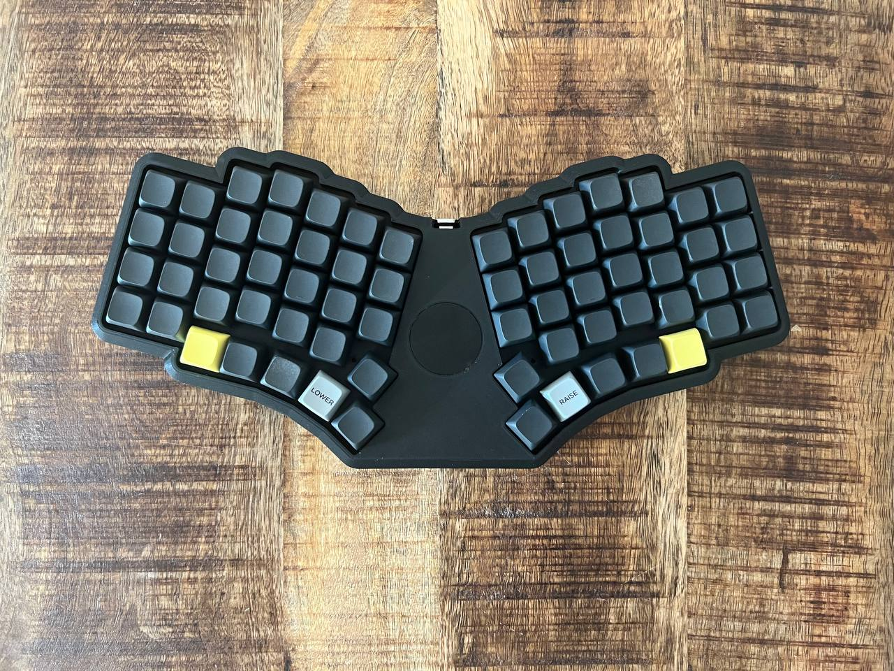
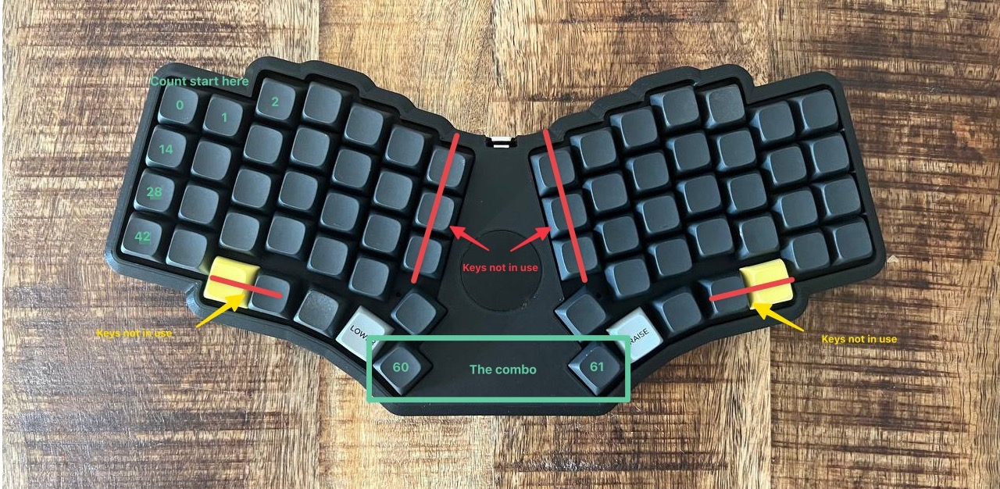

One of the greatest things (maybe even the greatest thing) about mechanical keyboards that provide custom firmware support (like QMK and ZMK) is the endless support for customization. I'm still tweaking my keymaps for different keyboards, but I recently started getting in to "Combos":

> Combo keys are a way to combine multiple key presses to output a different key. For example, you can hit the Q and W keys on your keyboard to output escape. 
> -- https://zmk.dev/docs/features/combos

# The problem

Having found my "ideal" number of key's being around 56 keys I had some issues with finding the correct place to place the <kbd>ENTER</kbd> key. I tried putting it on a dedicated key but I wanted it on my thumb cluster and I wanted it on a place where I could not press it accidentally. I tried working for a while with the <kbd>ENTER</kbd> being on a second layer but the combination of switching layer and then finding enter was too much of a hassle.

For reference, currently I'm using a [Fingerpunch rock on](https://fingerpunch.xyz/product-tag/rock-on/) and a [Montsinger Rebound-S](https://store.montsinger.net/products/rebound-s) with [ZMK](https://zmk.dev). I also created a combo on my [Moonlander](https://www.zsa.io/moonlander/) but to that we have to [set up a custom QMK firmware](https://github.com/zsa/qmk_firmware/).

The current physical layout/keyboard I'm working with:


_Fingerpunch rock on_

# Enter combos

To get around having <kbd>ENTER</kbd> on the main layer, not pressing it on accident and having it be accessible to my thumbs I came up with the idea of using a combo (also called a chord) to trigger <kbd>ENTER</kbd>. In this way I could combo 2 keys and send the keystroke.

## Deciding on the keys

I decided on using the innermost thumb keys for sending the <kbd>ENTER</kbd> combo. They are easy to find, and I use them a lot for other operations.
Because ZMK uses the number of the physical key we need to 'count' out which keys these are on the layout. All keys count towards the position you want to combo even if the keys are not in use. As explained on the ZMK documentation:

> Key positions are numbered like the keys in your keymap, starting at 0. So, if the first key in your keymap is Q, this key is in position 0. The next key (possibly W) will have position 1, etcetera.
> -- https://zmk.dev/docs/features/combos

In my case it came to a combo of key 60 and 61.

See the following example:


_Fingerpunch rock on with explanation_

## Setting up the combo

After finding out we wanted to create a combo on key 60 and 61 we can add the combo in our keymap:

```yaml
/ {
combos {
compatible = "zmk,combos";
combo_esc {
timeout-ms = <50>;
key-positions = <60 61>;
bindings = <&kp ENTER>;
    };
  };
};
```

With this setting we simply tell ZMK that if key 60 and 61 are pressed together witing a duration of `50ms` it should send the key press <kbd>ENTER</kbd>

# Closing

Setting up combo's on ZMK is really easy (once you know your key positions). It can add some awesome functionality like this <kbd>ENTER</kbd> key press. You can also use it to relocate some popular modifiers to you home row. You could for example, on a QWERTY layout, combo <kbd>d</kbd> and <kbd>f</kbd> to send <kbd>ESC</kbd>. Making it possible to send <kbd>Escape</kbd> without leaving you home row.
