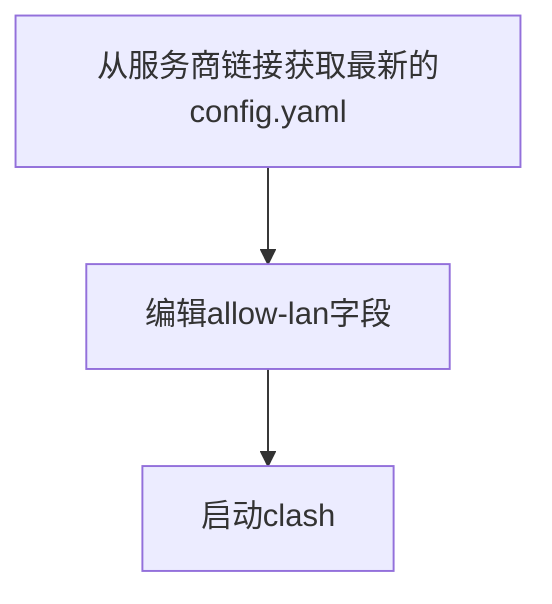

<!-- abstract begin -->
代理服务提供商提供的clash配置不能满足笔者的需求，而每次更新配置后如果手动编辑配置文件又显得有些麻烦。
经过一番痛苦的挣扎之后笔者决定将整个过程自动化。
<!-- abstract end -->

<!--more-->

<!-- begin include -->

<!-- end include -->

<!-- begin private variable of Liquid -->

<!--  -->
<!-- end private variable of Liquid -->

## 前情提要

在[之前的文章]()中笔者搭建了局域网代理服务器，使用一个systemd守护clash，并且自动在服务启动时更新clash配置文件。  
其大致流程如下所示。



之前的服务中已经对配置文件进行了简单的编辑，主要就修改了一个allow-lan字段和log-level字段，因为咱们需要最详细的日志信息和允许局域网连接。

> ```bash
> #!/bin/bash
> # save this file to ${HOME}/.config/clash/start-clash.sh
>
> # save pid file
> echo $$ > /etc/clash/clash.pid
> config=/etc/clash/config.yaml
> diff $config <(curl -s ${CLASH_URL})
> if [ $? != 0 ]; then
>     curl -L -o $config ${CLASH_URL}
> fi
>
> allow_lan=`sed -n '/allow-lan/=' ${config}`
> sed -i "${allow_lan}a allow-lan: true" ${config}
> sed -i "${allow_lan}d" ${config}
>
> log_level=`sed -n '/log-level/=' ${config}`
> sed -i "${log_level}a log-level: debug" ${config}
> sed -i "${log_level}d" ${config}
>
> /usr/local/bin/clash -d /etc/clash/
> ```

## 自动切换节点

官方提供的clash配置文件提供了一个自动切换的代理节点组，但是官方把所有的节点都列进去了，所以自动切换是在所有节点之间切换。  
而笔者需要一个只包含美国节点的自动切换组。

### Python编辑YAML

仍然使用之前的clash服务启动流程，在修改配置文件这一步引入更复杂的逻辑并使用python实现。

PyYAML库提供了读写yaml文件的字典抽象，因此可以使用python轻易编辑yaml而不用像之前bash一样使用正则表达式匹配。

### 实现结果

这里列出关键函数，其余部分笔者已[开源](https://github.com/yuxiaoyuan0406/ClashConfig/tree/master)。  
其中的函数`get_config`函数通过系统环境变量获取clash配置文件的下载链接，下载原始配置文件后转化为一个字典返回。

```python
def edit_config(input_file, output_file, do_update=True):
    if do_update:
        data = get_config()
        if data:
            pass
        else:
            print('Update fail, check internet connection or config link.')
            raise ConnectionError(f"Connection error or invalid link.")
            # return
    else:
        # read from YAML file
        with open(input_file, 'r') as file:
            data = yaml.safe_load(file)
            file.close()

    # default proxy group
    default_proxy_group = {
        "name": "default",
        "type": "url-test",
        "url": "http://www.gstatic.com/generate_204",
        "interval": 300,
        "proxies": []
    }

    # edit data
    ## create a auto switch group for United States proxies
    proxy_names = [proxy['name'] for proxy in data['proxies']]
    US_proxy_names = [name for name in proxy_names if 'UnitedStates' in name]
    
    US_proxy_group = dict(default_proxy_group)
    US_group_name = 'US-Auto'
    US_proxy_group['name'] = US_group_name
    US_proxy_group['proxies'] = US_proxy_names

    assert 'proxy-groups' in data
    assert type(data['proxy-groups']) is list
    # if type(data['proxy-groups']) is dict:
    #     data['proxy-groups'] = [ data['proxy-groups'] ]
    proxy_groups_names = [group['name'] for group in data['proxy-groups']]

    try:
        i = proxy_groups_names.index('Proxy')
        data['proxy-groups'][i]['proxies'].insert(0, US_group_name)
    except ValueError:
        select_proxy_group = dict(default_proxy_group)
        select_proxy_group['name'] = 'Proxy'
        select_proxy_group['type'] = 'select'
        select_proxy_group.pop('url', None)
        select_proxy_group.pop('interval', None)
        select_proxy_group['proxies'] = proxy_groups_names
        select_proxy_group['proxies'].insert(0, US_group_name)
        data['proxy-groups'].append(select_proxy_group)

    try:
        i = proxy_groups_names.index(US_group_name)
        data['proxy-groups'][i] = US_proxy_group
    except ValueError:
        data['proxy-groups'].insert(0, US_proxy_group)

    ## change allow lan
    data['allow-lan'] = True
    ## chane log level
    data['log-level'] = 'debug'
    
    # 将修改后的数据写回文件
    with open(output_file, 'w') as file:
        yaml.dump(data, file)
        file.close()
```

然后修改systemd调用的启动脚本，记得将python脚本放到`/etc/clash/update.py`。

```bash
#!/bin/bash
# save this file to ${HOME}/.config/clash/start-clash.sh

# save pid file
echo $$ > /etc/clash/clash.pid
config=/etc/clash/config.yaml
py=/etc/clash/update.py

/usr/bin/python3 $py --output /etc/clash/config.yaml --update

/usr/local/bin/clash -d /etc/clash/
```

## Clash配置自动编辑服务

上面的配置放到Linux上都非常方便，systemd真的好使。  
但对于Windows用户来说就比较麻烦了，每次可能还得需要手动运行脚本。

### Flask解决方案

好消息是，笔者的树莓派与Windows笔记本在同一个蒲公英子网内，所以可以在树莓派上搭建一个网络服务来实现自动化的更新。  
服务通过url访问并在访问时以参数形式传入代理服务商提供的链接，然后在树莓派上获取配置并编辑，最后返回给用户。  
例如如果用户访问下面的url：

```
http://raspberrypi.local:6789/?url=https://some.url
```

则服务器将从`https://some.url`下载文件，修改后发送给用户。

在询问ChatGPT之后，决定使用flask来实现功能。

### Flask服务和更安全的Gunicorn

基于之前的脚本修改主要功能。假设服务器域名为`raspberrypi.local`（这个其实是笔者树莓派的局域网域名），服务监听端口为6789。

GPT给出的服务器代码如下。

```python
from flask import Flask, request, send_file
import subprocess
import os

app = Flask(__name__)

@app.route('/')
def get_config():
    url = request.args.get('url')
    if url:
        # 调用 get_config.py 脚本
        subprocess.run(['python', 'main.py', '--url', url, '--output', 'output.yaml'])
        # 确保文件已生成
        if os.path.exists('output.yaml'):
            status = send_file('output.yaml')
            subprocess.run(['rm', 'output.yaml'])
            return status
        else:
            return "Failed to generate output file", 500
    else:
        return "No URL provided", 400

if __name__ == '__main__':
    app.run(host='0.0.0.0', port=6789)
```

这里由于我给GPT的提示词中提到一个已存在的脚本可以直接调用，所以GPT是以系统调用程序的形式来调用脚本，而不是通过调用函数的方式服用代码。  
测试没有问题，但GPT提到了一个安全问题，所以笔者又安装了Gunicorn。

使用Gunicorn的服务启动脚本如下。

```bash
gunicorn -w 4 -b 0.0.0.0:6789 server:app
```

这表示启动了4个工作进程，监听6789端口。

随后将python脚本、bash启动脚本等内容放到`/etc/clash-config`路径下，并编写service文件。

```
[Unit]
Description=Clash config daemon
After=network.target

[Service]
Type=simple
User=root
Restart=always
ExecStart=/etc/clash-config/start.sh

[Install]
WantedBy=multi-user.target
```

加入到systemd启动序列不谈。

### 使用方法

对于Clash for Windows用户而言，可以从一个url获取配置文件。  
只需要填入下面的链接就可以自动获取。

```text
http://raspberrypi.local:6789/?url=https://clash.config.yaml
```

## 总结

自动化修改clash配置文件是一个长久以来的需求，但一直没有足够的动力写复杂的逻辑。后来由于GPT的使用，我发现如果不用美国的节点可能会导致GPT访问不稳定，从而有了这样一个具体而强烈的需求。  
现在只要一台设备能访问到我的树莓派，那就可以直接从树莓派获取编辑后的clash配置文件。

## 参考

[Gunicorn](https://gunicorn.org/)
