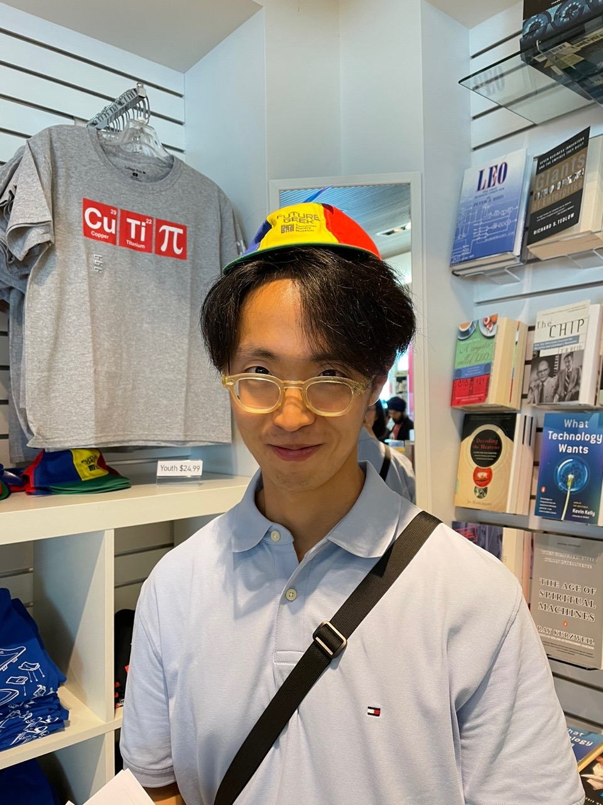
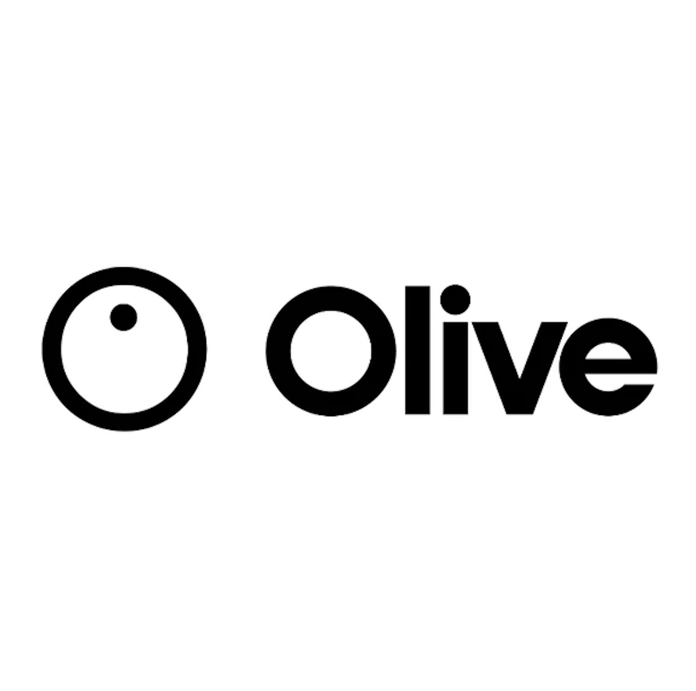

<!-- {:.profile} is adding configuration based on scss -->
{:.profile} 

### about

  Currently, I'm developing true-wireless earbuds for hard-hearing people as a digital signal processing engineer in <a href="https://us.oliveunion.com/"> Olive Union(Seoul, Republic of Korea)</a>. I received my Master's degree in Computer and Electronics Engineering. During my Master's studies, I researched designing for analog circuits in the high-speed interface. Specifically, My research focused on the PHY interface synchronizing blocks such as CPU and DRAM. Throughout this research, I was also interested in human-centered signals such as EEG. I attempted to find a method to obtain and process this analog data.
    
  Pursuing my graduate studies in the field of designing analog circuits and interest in human-centered signals has led me to challenge in speech. I am interested in speech processing with machine learning. Specifically, my research has concentrated on speech enhancement using machine learning techniques and implementation in micro-devices. With my background in understanding hardware devices and sound properties, I want to contribute to allowing these tiny devices to have a broader capacity to use signal processing and machine learning techniques on their constraints.
    
  In my free time, I love trail running and reading autobiographies and philosophical essays, especially Walter Isaacson, Albert Camus, and Friedrich Nietzsche.
    
  (Website last updated 11/2022)
    
  

    <a href="mailto:daniel.ohsj@gmail.com"> Email</a> • <a href="https://github.com/ooshyun"> Github</a> • <a href="https://www.notion.so/ooshyun/Seunghyun-Oh-3891a8e850834a8480cf3797cb49916e"> Notion</a>
         
  

---

### Education
{:.logo}

  

    Coursera
  

  

    DeepLearning.AI TensorFlow Developer
  

  

    Spring 2021
  

 

{:.logo}

  

    Hanyang University  
  

  

    Master in Electronics and Computer Engineering  
  

  

    Advisor. <a href="https://scholar.google.co.kr/citations?hl=en&user=OqA2u8UAAAAJ&view_op=list_works&sortby=pubdate">Changsik Yoo </a>
  

  

    Spring 2020  
  

 

{:.logo}

  

    Inha University
  

  

    B.A. in Information and Communication Engineering  
  
  
  

    Advisors. <a href="https://scholar.google.co.kr/citations?user=wcpWpdQAAAAJ&hl=ko">Kichang Kim</a> and <a href="http://icslab.cafe24.com/">Gyungsu Byun</a>  
  
  
  

    Spring 2018 
  

 

### Experience
{:.logo}

  

    <a href="https://us.oliveunion.com/">OliveUnion</a>
  

  

    Digital signal processing engineer    
  

  

    Apr 2020 - Current 
  

---
### Projects

  

    Speech Enhancement using LSTM  
    

      Spring 2022 to Spring 2023, Expected, <a href="https://github.com/ooshyun/cnn-audio-denoiser-voicebank">[Code]</a>, <a href="">Read more</a>   
    

  

   
  

    Olive Max, true wireless earbuds as hearing aid for severe hearing loss  
    

      Spring 2022 to Spring 2023, Expected, <a href="">Read more</a>
       
    

  

   
  

    Design Equalizer with cascasde and parallel biquid filter  
    

      Fall 2021, <a href="https://github.com/ooshyun/FilterDesign">[Code]</a>, <a href="">Read more</a>  
    
 
  
  
   
  

    Olive Pro, true wireless earbuds for hearing aid  
    

      Spring 2020 to Spring 2021, <a href="">Read more</a>  
    

  
  
   
  

    Delay Locked Loop for DDR3 and LPDDR3  
    

      Fall 2018 to Fall 2019, <a href="">Read more</a>  
    

  

   
  

    PHY Interface for DDR3 and LPDDR3  
    

      Spring 2018 to Spring 2019, <a href="">Read more</a>  
    

  

