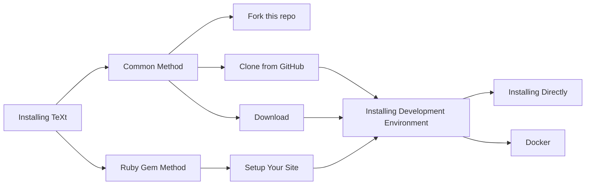

TeXt Theme is 100% compatible with GitHub Pages and it has been developed as a [gem-based themes](https://jekyllrb.com/docs/themes/) for easier use.

In this document, you will learn how to **install the theme**, **setup your site**, **local preview** for development, **build** and **publish**.

<!--more-->



## Installing the Theme

### Common Method

To install it with common method, all you need to do is copying all the theme files to your project. There are several ways to do so:

1. Clone [jekyll-TeXt-theme](https://github.com/kitian616/jekyll-TeXt-theme) from github.

   **Clone with HTTPS:**

   ```bash
   git clone https://github.com/kitian616/jekyll-TeXt-theme.git
   ```

   **Clone with SSH:**

   ```bash
   git clone git@github.com:kitian616/jekyll-TeXt-theme.git
   ```

2. Download and unzip the file to your Jekyll site directory.

   <a class="button button--success button--rounded" href="https://github.com/kitian616/jekyll-TeXt-theme/archive/master.zip"><i class="fas fa-download"></i> Download TeXt Theme</a>

3. If you host your site on GitHub Pages, you can just fork [jekyll-TeXt-theme](https://github.com/kitian616/jekyll-TeXt-theme), then rename the repository to **USERNAME.github.io** — replacing **USERNAME** with your GitHub username.

   

   

### Ruby Gem Method

1. Add this line to your Jekyll site’s *Gemfile*:

   ```ruby
   gem "jekyll-text-theme"
   ```

2. Add this line to your Jekyll site’s *_config.yml* file:

   ```yaml
   theme: jekyll-text-theme
   ```

## Setup Your Site

If you install the theme with common method, you can go straight to the next step. But **if you install the theme with ruby gem method, you have to do some extra jobs**.

With gem-based themes, some of the site’s directories (such as the *assets*, *_layouts*, *_includes* and *_sass* directories) are stored in the theme’s gem, hidden from your immediate view. You need add some files in your Jekyll site directory:

```bash
├── 404.html
├── Gemfile
├── _config.yml
├── _data
│   └── locale.yml
├── _posts
│   └── ...
├── about.md
├── archive.html
└── index.html
```

You can refer to the [/test folder](https://github.com/kitian616/jekyll-TeXt-theme/tree/master/test), this is a example with gem-based themes.

## Installing Development Environment

If you want to run them them locally, you need first install Ruby and Jekyll, see [Installation](https://jekyllrb.com/docs/installation/) for details.

After that, run bundler to install the dependencies:

```bash
bundle install --path vendor/bundle
```

And also, TeXt offer [Docker](https://www.docker.com/) support for development and public, this make it easier to setup environment.

{:width="400px"}

All you need todo is these 3 steps:

1. [Install Docker](https://docs.docker.com/install/).

2. Generate *Gemfile.lock*:

   ```bash
   docker run --rm -v "$PWD":/usr/src/app -w /usr/src/app ruby:2.6 bundle install
   ```

3. Build Docker image:

   ```bash
   docker-compose -f ./docker/docker-compose.build-image.yml build
   ```

## Local Preview

Run `bundle exec jekyll serve` to start the development server, then you can visit [http://localhost:4000/](http://localhost:4000/) to preview your site.

For Docker, run `docker-compose -f ./docker/docker-compose.default.yml up` to start the development server.

## Build and Publish

If you host your site on GitHub Pages, just push the source to the master branch of your USERNAME.github.io repository, GitHub would build automatically. You can visit your site on **https://USERNAME.github.io** several minutes later.

If you host your site on your server, you need first run `JEKYLL_ENV=production bundle exec jekyll build` to generated your site, then update the files in *_site* folder to your server.