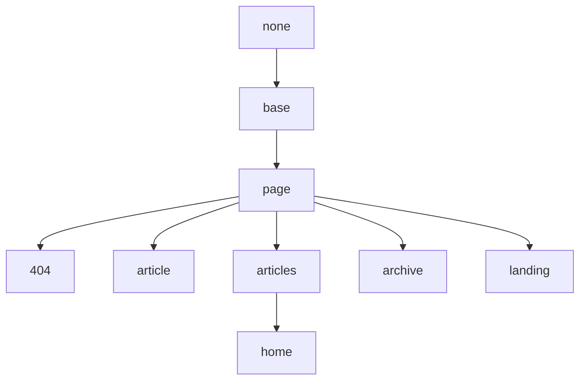

## Base Layout

Base on None.

## Page Layout

Base on Base Layout.

| Variable          | Option Values         | Description | Minimum Version |
| ---               | ---                   | ---         | ---     |
| **mode**          | normal (default), immersive | mode of the page. | 2.2.0 |
| **type**          | webpage (default), article | type of the page, used by [schema.org](https://schema.org/) markup. | |
| **key**           | `!!str`               | Unique key for the post, required by Comments and Pageview. begin with a letter (`[A-Za-z]`) and may be followed by any number of letters, digits (`[0-9]`), hyphens (`-`), underscores (`_`), colons (`:`), and periods (`.`). | |
| **lang**          | en (default), zh, zh-Hans, zh-Hant | Language of this page. | |
| **author**        | `!!map`               | Assign one of the authors in *authors.yml* to a post or page, see [Authors](https://tianqi.name/jekyll-TeXt-theme/docs/en/authors) for detail. | 2.2.0 |
| **show_title**    | true (default), false | Set as `false` to hide title on this page. | |
| **show_edit_on_github** | true, false (default) | Set as `true` to show “Edit on Github” button. you need set `repository` and `repository_tree` in *_config.yml* first. | |
| **show_date**     | true (default), false | Set as `false` to hide date on this page. | 2.2.0 |
| **show_tags**     | true (default), false | Set as `false` to hide tags on this page. | 2.2.0 |
| **full_width**    | true, false (default) | Set as `true` to make main full width on this page. | |
| **pageview**      | true, false (default) | Set as `true` to enable pageview on this page. | 2.2.0 |
| **comment**       | true (default), false | Set as `false` to disable comment on this page. | |
| **mathjax**       | true, false           | Set as `true` to enable Mathjax on this page. | |
| **mathjax_autoNumber** | true, false      | Set as `true` to enable Mathjax autoNumber on this page. | |
| **mermaid**       | true, false           | Set as `true` to enable Mermaid on this page. | |
| **chart**         | true, false           | Set as `true` to enable Chart on this page. | |
| **cover**         | `!!str`               | Url of the cover image. | 2.2.0 |
| **header**        | false, `!!map`        | Set as `false` to hide header on this page. | 2.2.0 |
| **article_header**| `!!map`               | | 2.2.0 |
| **aside**         | `!!map`               | | |
| **sidebar**       | `!!map`               | | |
| **footer**        | false                 | Set as `false` to hide footer on this page. | 2.2.3 |
| **lightbox**      | true, false           | Set as `true` to enable lightbox (modal image gallery) for large images on this page, you can set `lightbox-ignore` class name to ignore the certain image. | 2.2.4 |

### header

| Variable          | Option Values         | Description |
| ---               | ---                   | ---         |
| **theme**         | light, dark           | |
| **background**    | `!!str`               | Available when specified theme. |

### article_header

| Variable          | Option Values         | Description |
| ---               | ---                   | ---         |
| **type**          | overlay, cover        | |
| **align**         | left (default), center| |
| **theme**         | light (default), dark | |
| **background_color** | `!!str`            | Available when type is `overlay`. If set to a dark color, you need set theme as 'dark'. |
| **background_image** | `!!map`            | Available when type is `overlay`, set as `false` can overwrite `cover` to disable background image. |
| **image**         | `!!map`               | Available when type is `cover`. |
| **actions**       | `!!seq`               | |

### article_header.background_image

| Variable          | Option Values         | Description |
| ---               | ---                   | ---         |
| **gradient**      | `!!str`               | |
| **src**           | `!!str`               | Default to `cover` |

### article_header.image

| Variable          | Option Values         | Description |
| ---               | ---                   | ---         |
| **src**           | `!!str`               | |

### aside

| Variable          | Option Values         | Description |
| ---               | ---                   | ---         |
| **toc**           | true, false           | Set as `true` to enable TOC on this page's aside. |

### sidebar

| Variable          | Option Values         | Description |
| ---               | ---                   | ---         |
| **nav**           | `!!str`               | |

## Article Layout

Base on Page Layout.

| Variable          | Option Values         | Description | Minimum Version |
| ---               | ---                   | ---         | ---     |
| **modify_date**   | `!!str`               | The last modified date of this article, the date is modified in the format `YYYY-MM-DD HH:MM:SS +/-TTTT`; hours, minutes, seconds, and timezone offset are optional. just like `date` variable. | |
| **sharing**       | true, false (default) | Set as `true` to enable Sharing on this article. | 2.2.2 |
| **show_author_profile** | true, false (default) | Set as `true` to show author profile at the beginning of the article. | |
| **show_subscribe**| true, false (default) | Set as `true` to show subscribe info on this page. | latest |
| **license**       | true, false (default), CC-BY-4.0, CC-BY-SA-4.0, CC-BY-NC-4.0, CC-BY-ND-4.0 | license of the article. Set true to use `license` variable that set in *_config.yml*, set false to enable it. | |

## Articles Layout

Base on Page Layout, available since version **2.2.0**.

| Variable          | Option Values         | Description |
| ---               | ---                   | ---         |
| **articles**      | `!!map`               | |

### articles

| Variable          | Option Values         | Description |
| ---               | ---                   | ---         |
| **data_source**   | `!!str`               | You can set it as a collections name, then the page will show the article list of this collections. You can refer to [Collections](https://jekyllrb.com/docs/collections/) to learn more about collections. |
| **type**          | item, brief, grid | TeXt supports 3 article list type with various settings, yan can find examples [HERE](https://tianqi.name/jekyll-TeXt-theme/samples.html#articles-layout). |
| **size**          | md, sm        | Available when type is `grid`. |
| **article_type**  | BlogPosting       | Available when type is `normal`. |
| **show_cover**    | true (default), false | Available when type is `normal`. Before set it to `true`, you need first set each article a cover image, refer to the `cover` variable in [Page Layout](#page-layout). |
| **cover_size**    | lg, md, sm | Available when type is `normal`. |
| **show_excerpt**  | true, false (default) | Available when type is `normal`, refer to [excerpt_type](#excerpt_type) below. |
| **excerpt_type**  | text, html    | Available when type is `normal`. |
| **show_readmore** | true, false (default) | Available when type is `normal`. |
| **show_info**     | true, false (default) | Available when type is `normal` or `brief`. |

### articles.excerpt_type

Each post automatically takes the first block of text, from the beginning of the content to the first occurrence of `excerpt_separator`, and sets it as the post’s excerpt.

The excerpt is show in the article list in the Articles and Home Layout. There are two excerpt types, text type and html type.

| Type Name | Description |
| ---       | ---         |
| **text** | the excerpt are plain text that filters out all non-text elements (such as title, link, list, table, picture, etc.) and only show 350 characters most. |
| **html** | the excerpt are HTML document just like the content of the article, This will show all the content by default, except adding `<!--more-->` in the article Markdown file, You can find more info [HERE](https://jekyllrb.com/docs/posts/#post-excerpts).  |

For the home page, you can set `excerpt_type` to `HTML` like this:

```yaml
layout: home
articles:
  excerpt_type: html
```

## Home Layout

Base on Articles Layout.

## Archive Layout

Base on Page Layout.

## Landing Layout

Base on Page Layout.

| Variable          | Option Values         | Description |
| ---               | ---                   | ---         |
| **data**          | `!!map`               | |

## 404 Layout

Base on Page Layout.
