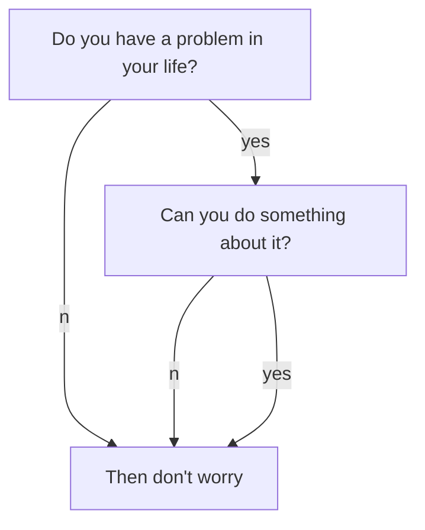

You need set the variable true in the *_config.yml* or in the YAML Front Matter to enable markdown enhancement.

| Enhancemen Name | Description |
| --------------- | ----------- |
| **Mathjax** | Make it easy to add mathematics in articles, using MathML, LaTeX and ASCIIMathML markup | [EXAMPLES](https://kitian616.github.io/jekyll-TeXt-theme/post/2017/07/07/mathjax.html) |
| **Mermaid** | Bring diagrams and flowcharts in articles | [EXAMPLES](https://kitian616.github.io/jekyll-TeXt-theme/post/2017/06/06/mermaid.html) |
| **Chart**   | Bring charts in articles | [EXAMPLES](https://kitian616.github.io/jekyll-TeXt-theme/post/2017/05/05/chart.html) |

## Mathjax

When $$a \ne 0$$, there are two solutions to $$ax^2 + bx + c = 0$$ and they are

$$x_1 = {-b + \sqrt{b^2-4ac} \over 2a}$$

$$x_2 = {-b - \sqrt{b^2-4ac} \over 2a} \notag$$

**markdown:**

```tex
When $$a \ne 0$$, there are two solutions to $$ax^2 + bx + c = 0$$ and they are
$$x_1 = {-b + \sqrt{b^2-4ac} \over 2a}$$
$$x_2 = {-b - \sqrt{b^2-4ac} \over 2a} \notag$$
```

**After MathJax enabled**, you can set `mathjax_autoNumber: true` to have equations be numbered automatically, You can use \notag or \nonumber to prevent individual equations from being numbered.
{:.info}

## Mermaid



**markdown:**

    ```mermaid
    graph TB;
        A[Do you have a problem in your life?]
        B[Then don't worry]
        C[Can you do something about it?]
        A--no-->B;
        A--yes-->C;
        C--no-->B;
        C--yes-->B;
    ```

[Mermaid](https://mermaidjs.github.io/) supports 3 kinds of diagram:

- [Flowchart](https://mermaidjs.github.io/flowchart.html)

- [Sequence Diagram](https://mermaidjs.github.io/sequenceDiagram.html)

- [Gant Diagram](https://mermaidjs.github.io/gantt.html)

## Chart

```chart
{
  "type": "line",
  "data": {
    "labels": [
      "January",
      "February",
      "March",
      "April",
      "May",
      "June",
      "July"
    ],
    "datasets": [
      {
        "label": "# of bugs",
        "fill": false,
        "lineTension": 0.1,
        "backgroundColor": "rgba(75,192,192,0.4)",
        "borderColor": "rgba(75,192,192,1)",
        "borderCapStyle": "butt",
        "borderDash": [],
        "borderDashOffset": 0,
        "borderJoinStyle": "miter",
        "pointBorderColor": "rgba(75,192,192,1)",
        "pointBackgroundColor": "#fff",
        "pointBorderWidth": 1,
        "pointHoverRadius": 5,
        "pointHoverBackgroundColor": "rgba(75,192,192,1)",
        "pointHoverBorderColor": "rgba(220,220,220,1)",
        "pointHoverBorderWidth": 2,
        "pointRadius": 1,
        "pointHitRadius": 10,
        "data": [
          65,
          59,
          80,
          81,
          56,
          55,
          40
        ],
        "spanGaps": false
      }
    ]
  },
  "options": {}
}
```

**markdown:**

    ```chart
    {
      "type": "polarArea",
      "data": {
        "datasets": [
          {
            "data": [
              11,
              16,
              7,
              3,
              14
            ],
            "backgroundColor": [
              "#FF6384",
              "#4BC0C0",
              "#FFCE56",
              "#E7E9ED",
              "#36A2EB"
            ],
            "label": "My dataset"
          }
        ],
        "labels": [
          "Red",
          "Green",
          "Yellow",
          "Grey",
          "Blue"
        ]
      },
      "options": {}
    }
    ```

[Chart.js](http://www.chartjs.org/docs/latest/) supports 7 kinds of chart:

- [Line Chart](http://www.chartjs.org/docs/latest/charts/line.html)

- [Bar Chart](http://www.chartjs.org/docs/latest/charts/bar.html)

- [Radar Chart](http://www.chartjs.org/docs/latest/charts/radar.html)

- [Polar Area Chart](http://www.chartjs.org/latest/charts/polar.html)

- [Pie Chart](http://www.chartjs.org/docs/latest/charts/doughnut.html)

- [Doughnut Chart](http://www.chartjs.org/docs/latest/charts/doughnut.html)

- [Bubble Chart](http://www.chartjs.org/docs/latest/charts/bubble.html)
