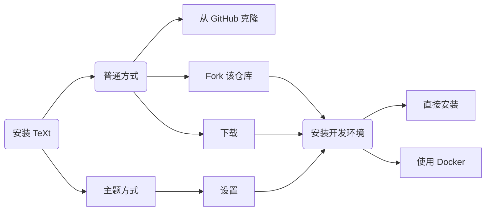

TeXt 是一款 100% 兼容 GitHub Pages 的 Jekyll 主题，你可以通过 Fork、下载或主题等方式安装。

在这篇文章中，你将学到如何**安装设置主题**，通过**本地预览**进行开发以及**编译**和**发布**。

<!--more-->



## 安装

### 普通方式

这种方式要求你的项目里包含所有的主题文件，你可以通过以下途径来安装：

1. 从 GitHub 克隆 [jekyll-TeXt-theme](https://github.com/kitian616/jekyll-TeXt-theme) 项目:

   **通过 HTTPS 方式克隆：**

   ```bash
   git clone https://github.com/kitian616/jekyll-TeXt-theme.git
   ```

   **通过 SSH 方式克隆：**

   ```bash
   git clone git@github.com:kitian616/jekyll-TeXt-theme.git
   ```

2. 下载主题压缩包并解压到你的项目目录中：

   <a class="button button--success button--rounded" href="https://github.com/kitian616/jekyll-TeXt-theme/archive/master.zip"><i class="fas fa-download"></i> 下载 TeXt 主题</a>

3. 如果你打算在 GitHub Pages 上搭建你的网站，你可以直接 fork [jekyll-TeXt-theme](https://github.com/kitian616/jekyll-TeXt-theme) 到你的仓库，然后将其重命名为 **USERNAME.github.io** — 这里的 **USERNAME** 是你的 GitHub 用户名。

   

   

### 主题方式

1. 若要安装一套主题，请先将该主题添加到您站点的 *Gemfile* 文件中：

   ```ruby
   gem "jekyll-text-theme"
   ```

2. 向站点的 *_config.yml* 中加入下列代码来启用主题：

   ```yaml
   theme: jekyll-text-theme
   ```

## 设置

**这里仅针对主题方式的安装，普通方式安装请跳过。**

Jekyll 主题含有主题默认的布局文件、包含文件和样式表， 但是有些目录（例如*assets*, *_layouts*, *_includes* 以及 *_sass* 目录）需要手动添加到项目目录中，这样的好处在于将主题的文件和站点的内容和配置隔离开来，方便主题的升级。

```bash
├── 404.html
├── Gemfile
├── _config.yml
├── _data
│   └── locale.yml
├── _posts
│   └── ...
├── about.md
├── archive.html
└── index.html
```

你可以参考主题源码的 [/test 目录](https://github.com/kitian616/jekyll-TeXt-theme/tree/master/test), 这是一个使用主题的示例。

## 安装开发环境

如果你想本地运行主题，你需要安装 Ruby 以及 Jekyll，详情请戳 [这里](https://jekyllrb.com/docs/installation/)。

上述步骤完成后，安装 Ruby 依赖包：

```bash
bundle install --path vendor/bundle
```

当然，TeXt 还提供了 [Docker](https://www.docker.com/) 支持，使用 Docker 能让你更方便的完成环境的安装，并且环境统一，不会出错。

{:width="400px"}

你只需要以下 3 步即可通过 Docker 完成环境的搭建：

1. [安装 Docker](https://docs.docker.com/install/)。

2. 生成 *Gemfile.lock* 文件：

   ```bash
   docker run --rm -v "$PWD":/usr/src/app -w /usr/src/app ruby:2.6 bundle install
   ```

3. 创建 Docker 镜像 (Image)：

   ```bash
   docker-compose -f ./docker/docker-compose.build-image.yml build
   ```

## 本地预览

Jekyll 集成了一个开发用的服务器，可以让你使用浏览器在本地进行预览。

通过 `bundle exec jekyll serve` 命令启动开发服务器，然后你就可以访问 [http://localhost:4000/](http://localhost:4000/) 预览你的网站了。

如果是通过 Docker 搭建的环境，请运行 `docker-compose -f ./docker/docker-compose.default.yml up` 命令以启动开发服务器。

## 编译和发布

如果你打算把网站搭建在 GitHub Pages 上，那你所需要做的就是将项目的源码上传到 USERNAME.github.io 源码仓库的 master 分支，GitHub 会自动的编译，几分钟后你就可以通过 **https://USERNAME.github.io** 访问到你的网站了。

如果你的网站是搭建在其他服务器上的，那么你就需要来自己编译了。首先运行命令 `JEKYLL_ENV=production bundle exec jekyll build` 编译你的网站，然后将编译的文件（位于 *_site* 目录）更新到你的服务器上。
