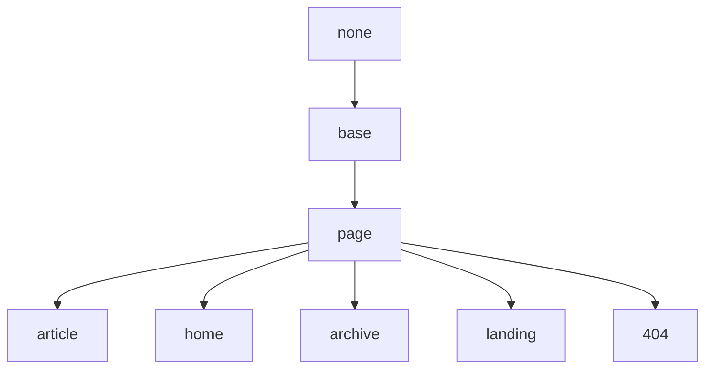

## Base 布局

继承于 None。

## Page 布局

继承于 Base 布局。

| Variable          | Option Values         | Description |
| ---               | ---                   | ---         |
| **mode**          | "normal" (default), "immersive" | 该页的模式 |
| **type**          | "webpage" (default), "article" | 该页的类型, 作为 [schema.org](https://schema.org/) 的语义化标记使用 |
| **key**           | `!!str`               | 页面的唯一标识符，供评论系统和点击量统计使用。必须以字母（`[A-Za-z]`）开头，其后可以接若干字母、数字（`[0-9]`）、连字符（`-`）、下划线（`_`）、冒号（`:`）和小数点（`.`） |
| **lang**          | "en" (default), "zh", "zh-Hans", "zh-Hant" | 该页的语言 |
| **author**        | `!!map`               | 将在 *authors.yml* 中定义的作者作为某篇文章或页面的作者, 详情请看[作者](https://tianqi.name/jekyll-TeXt-theme/docs/zh/authors) |
| **show_title**    | true (default), false | 是否显示标题，默认显示，设置为 `false` 隐藏 |
| **show_edit_on_github** | true, false (default) | 是否显示“在 Github 上修改”按钮，设置为 `true` 显示。你需要先在 *_config.yml* 中设置 `repository` 和 `repository_tree` |
| **show_date**     | true (default), false | 是否展示该页的发布日期，设置为 `false` 隐藏。 |
| **show_tags**     | true (default), false | 是否展示该页的标签，设置为 `false` 隐藏。 |
| **full_width**    | true, false (default) | 该页内容是否占据全部宽度，设置为 `true` 开启 |
| **pageview**      | true, false (default) | 是否开启阅读量统计，默认关闭，设置为 `true` 开启 |
| **comment**       | true (default), false | 是否开启评论支持，默认开启，设置为 `false` 关闭 |
| **mathjax**       | true, false           | 是否开启 Mathjax 公式支持，设置为 `true` 开启 |
| **mathjax_autoNumber** | true, false      | 该页的 Mathjax 公式是否自动编号，设置为 `true` 开启 |
| **mermaid**       | true, false           | 是否开启 Mermaid 流程图支持，设置为 `true` 开启 |
| **chart**         | true, false           | 是否开启 Chart 图表支持，设置为 `true` 开启 |
| **header**        | false, `!!map`        | 设置为 `false` 隐藏标题栏 |
| **article_header**| `!!map`               | |
| **aside**         | `!!map`               | |
| **sidebar**       | `!!map`               | |

### header

| Variable          | Option Values         | Description |
| ---               | ---                   | ---         |
| **type**          | "normal" (default), "translucent" | |
| **theme**         | "light" (default), "dark" | 当 type 为 "translucent" 时有效 |

### article_header

| Variable          | Option Values         | Description |
| ---               | ---                   | ---         |
| **type**          | "overlay", "cover"    | |
| **align**         | "left" (default), "center" | |
| **theme**         | "light" (default), "dark" | |
| **background_color** | `!!str`            | 当 type 为 "overlay" 时有效 |
| **background_image** | `!!str`            | 当 type 为 "overlay" 时有效 |
| **image**         | `!!str`               | 当 type 为 "cover" 时有效 |
| **actions**       | `!!seq`               | |

### aside

| Variable          | Option Values         | Description |
| ---               | ---                   | ---         |
| **toc**           | false (default), true | 设置为 `true` 时展示右侧边栏目录 |

### sidebar

| Variable          | Option Values         | Description |
| ---               | ---                   | ---         |
| **nav**           | `!!str`               | |

## Article 布局

继承于 Page 布局。

| Variable          | Option Values         | Description |
| **modify_date**   | `!!str`               | 该文章的最后修改时间, 其格式为 `YYYY-MM-DD HH:MM:SS +/-TTTT` 和 `date` 的格式相同 |
| **show_author_profile** | true, false (default) | 是否在文章开头显示作者信息卡片，设置为 `true` 显示 |
| **license**       | true, false (default), "CC-BY-4.0", "CC-BY-SA-4.0", "CC-BY-NC-4.0", "CC-BY-ND-4.0" | 该文章的许可协议。设置为 `true` 使用在 *_config.yml* 中设置的 `license` 值，设置为 `false` 不使用许可协议 |

## Home 布局

继承于 Page 布局。

## Archive 布局

继承于 Page 布局。

## Landing 布局

继承于 Page 布局。

| Variable          | Option Values         | Description |
| ---               | ---                   | ---         |
| **data**          | `!!map`                 | |

## 404 布局

继承于 Page 布局。