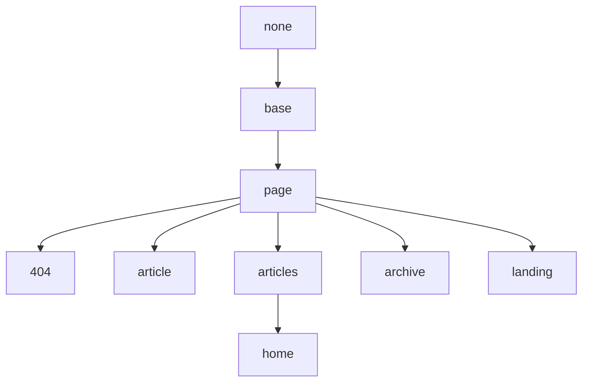

## Base 布局

继承于 None。

## Page 布局

继承于 Base 布局。

| 配置项             | 可选值                 | 描述        | 最低版本 |
| ---               | ---                   | ---         | ---    |
| **mode**          | normal (default), immersive | 该页的模式。 | 2.2.0 |
| **type**          | webpage (default), article | 该页的类型, 作为 [schema.org](https://schema.org/) 的语义化标记使用。 | |
| **key**           | `!!str`               | 页面的唯一标识符，供评论系统和点击量统计使用。必须以字母（`[A-Za-z]`）开头，其后可以接若干字母、数字（`[0-9]`）、连字符（`-`）、下划线（`_`）、冒号（`:`）和小数点（`.`）。 | |
| **lang**          | en (default), zh, zh-Hans, zh-Hant | 该页的语言。 | |
| **author**        | `!!map`               | 将在 *authors.yml* 中定义的作者作为某篇文章或页面的作者, 详情请看[作者](https://tianqi.name/jekyll-TeXt-theme/docs/zh/authors)。 | 2.2.0 |
| **show_title**    | true (default), false | 是否显示标题，默认显示，设置为 `false` 隐藏。 | |
| **show_edit_on_github** | true, false (default) | 是否显示“在 Github 上修改”按钮，设置为 `true` 显示。你需要先在 *_config.yml* 中设置 `repository` 和 `repository_tree`。 | |
| **show_date**     | true (default), false | 是否展示该页的发布日期，设置为 `false` 隐藏。 | 2.2.0 |
| **show_tags**     | true (default), false | 是否展示该页的标签，设置为 `false` 隐藏。 | 2.2.0 |
| **full_width**    | true, false (default) | 该页内容是否占据全部宽度，设置为 `true` 开启。 | |
| **pageview**      | true, false (default) | 是否开启阅读量统计，默认关闭，设置为 `true` 开启。 | 2.2.0 |
| **comment**       | true (default), false | 是否开启评论支持，默认开启，设置为 `false` 关闭。 | |
| **mathjax**       | true, false           | 是否开启 Mathjax 公式支持，设置为 `true` 开启。 | |
| **mathjax_autoNumber** | true, false      | 该页的 Mathjax 公式是否自动编号，设置为 `true` 开启。 | |
| **mermaid**       | true, false           | 是否开启 Mermaid 流程图支持，设置为 `true` 开启。 | |
| **chart**         | true, false           | 是否开启 Chart 图表支持，设置为 `true` 开启。 | |
| **cover**         | `!!str`               | 封面图片的 URL。 | |
| **header**        | false, `!!map`        | 设置为 `false` 隐藏标题栏。 | 2.2.0 |
| **article_header**| `!!map`               | | 2.2.0 |
| **aside**         | `!!map`               | | |
| **sidebar**       | `!!map`               | | |
| **footer**        | false                 | 设置为 `false` 隐藏底部栏。 | 2.2.3 |
| **lightbox**      | true, false           | 该页的大图是否能点击预览，设置为 `true` 开启，你可以通过设置 `lightbox-ignore` 类名来忽略特定的图片元素。 | 2.2.4 |

### header

| 配置项             | 可选值                 | 描述        |
| ---               | ---                   | ---         |
| **theme**         | light, dark           | 当 type 为 `translucent` 时有效。 |
| **background**    | `!!str`               | 当指定了 theme 值时有效。 |

### article_header

| 配置项             | 可选值                 | 描述        |
| ---               | ---                   | ---         |
| **type**          | overlay, cover        | |
| **align**         | left (default), center | |
| **theme**         | light (default), dark | |
| **background_color** | `!!str`            | 当 type 为 `overlay` 时有效。当设置的背景色较深时，你需要设置 `theme` 为 dark。 |
| **background_image** | `!!map`            | 当 type 为 `overlay` 时有效，设置为 `false` 可覆盖 `cover` 禁止背景图片。 |
| **image**         | `!!map`               | 当 type 为 `cover` 时有效。 |
| **actions**       | `!!seq`               | |

### article_header.background_image

| Variable          | Option Values         | Description |
| ---               | ---                   | ---         |
| **gradient**      | `!!str`               | |
| **src**           | `!!str`               | 默认为 `cover` |

### article_header.image

| Variable          | Option Values         | Description |
| ---               | ---                   | ---         |
| **src**           | `!!str`               | |

### aside

| 配置项             | 可选值                 | 描述        |
| ---               | ---                   | ---         |
| **toc**           | false (default), true | 设置为 `true` 时展示右侧边栏目录。 |

### sidebar

| 配置项             | 可选值                 | 描述        |
| ---               | ---                   | ---         |
| **nav**           | `!!str`               | |

## Article 布局

继承于 Page 布局。

| 配置项 | 可选值 | 描述 | 最低版本 |
| --- | --- | --- | --- |
| **modify_date**   | `!!str`               | 该文章的最后修改时间, 其格式为 `YYYY-MM-DD HH:MM:SS +/-TTTT` 和 `date` 的格式相同 | |
| **sharing**       | true, false (default) | 是否开启分享，设置为 `true` 开启。 | 2.2.2 |
| **show_author_profile** | true, false (default) | 是否在文章开头显示作者信息卡片，设置为 `true` 显示。 | |
| **show_subscribe**| true, false (default) | 是否在文章末尾显示订阅信息，设置为 `true` 显示。 | latest |
| **license**       | true, false (default), CC-BY-4.0, CC-BY-SA-4.0, CC-BY-NC-4.0, CC-BY-ND-4.0 | 该文章的许可协议。设置为 `true` 使用在 *_config.yml* 中设置的 `license` 值，设置为 `false` 不使用许可协议。 | |

## Articles 布局

继承于 Page 布局，从 **2.2.0** 版本支持。

| 配置项             | 可选值                 | 描述        |
| ---               | ---                   | ---         |
| **articles**      | `!!map`               | |

### articles

| 配置项             | 可选值                 | 描述        |
| ---               | ---                   | ---         |
| **data_source**   | `!!str`               | 如果你将将集合名设置为该项的值，该页面将会展示这个集合下的文章列表。你可以在 [Collections](https://jekyllrb.com/docs/collections/) 找到更多关于集合的信息。 |
| **type**          | item, brief, grid | TeXt 支持三种文章列表类型，每种类型都对应着一些配置，你可以在 [这里](https://tianqi.name/jekyll-TeXt-theme/samples.html#articles-layout) 看到相关的示例。 |
| **size**          | md, sm        | 当 type 为 `grid` 时有效。 |
| **article_type**  | BlogPosting       | 当 type 为 `normal` 时有效。 |
| **show_cover**    | true (default), false | 当 type 为 `normal` 时有效。 在设置改参数为 `true` 前，你需要给集合里的每篇文章设置封面, 参考 [Page 布局](#page-layout)的 `cover` 配置项。 |
| **cover_size**    | lg, md, sm | 当 type 为 `normal` 时有效。 |
| **show_excerpt**  | true, false (default) | 当 type 为 `normal` 时有效， 参考下面 [excerpt_type](#excerpt_type) 章节。 |
| **excerpt_type**  | text, html    | 当 type 为 `normal` 时有效。 |
| **show_readmore** | true, false (default) | 当 type 为 `normal` 时有效。 |
| **show_info**     | true, false (default) | 当 type 为 `normal` 或 `brief` 时有效。 |

### articles.excerpt_type

文章列表中文章项的摘要有两种模式——TEXT 模式和 HTML 模式。

| 模式名称 | 描述 |
| --- | --- |
| **text** | 此时摘要为纯文本，会过滤掉一切非文本元素（标题，链接，列表，表格，图片等等），且截取前 350 个字符。 |
| **html** | 此时摘要为 HTML 文档，与文章内容一致，并且 **默认展示整篇文章的内容**。若想控制摘要内容，需要在文章中想要显示到的地方加上 `<!--more-->`，详情请戳 [这里](https://jekyllrb.com/docs/posts/#post-excerpts)。  |

对于 Home 页，你可以像这样把 `excerpt_type` 设置为 `HTML`：

```yaml
layout: home
articles:
  excerpt_type: html
```

## Home 布局

继承于 Articles 布局。

## Archive 布局

继承于 Page 布局。

## Landing 布局

继承于 Page 布局。

| 配置项             | 可选值                 | 描述        |
| ---               | ---                   | ---         |
| **data**          | `!!map`               | |

## 404 布局

继承于 Page 布局。