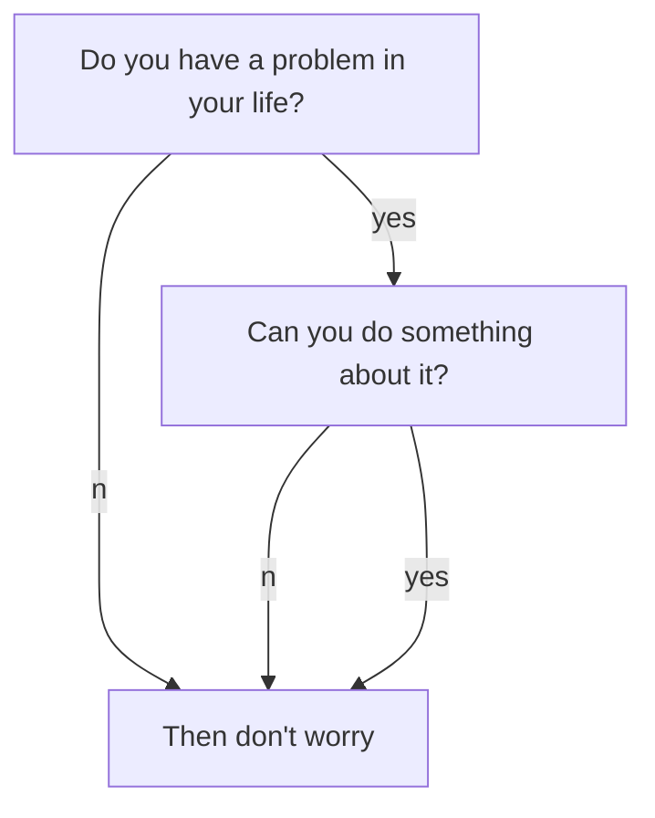
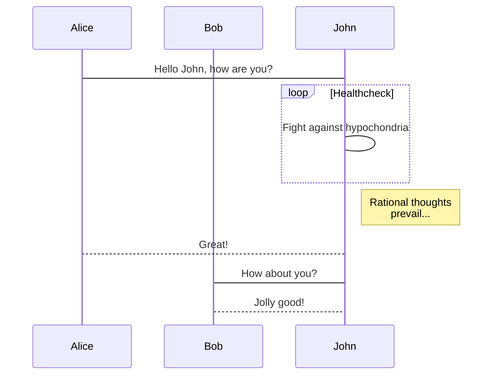
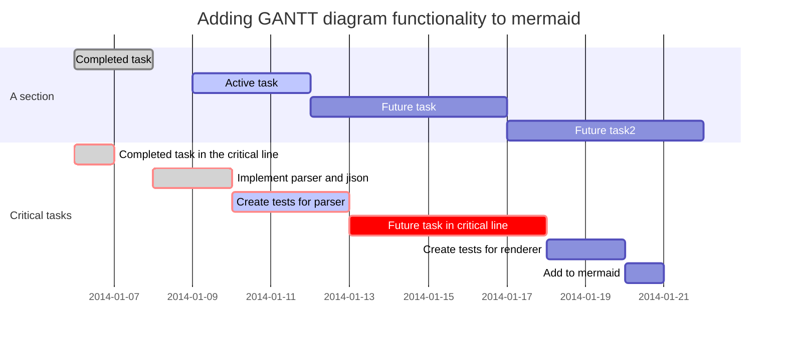

<!--more-->

You need set `mermaid: true` in the *_config.yml* or the markdown’s front matter to **enable** it.
{:.warning}

[Documentation](https://kitian616.github.io/jekyll-TeXt-theme/docs/en/markdown-enhancements#mermaid)

Generation of diagrams and flowcharts from text in a similar manner as markdown.

Ever wanted to simplify documentation and avoid heavy tools like Visio when explaining your code?

This is why [mermaid](https://mermaidjs.github.io/) was born, a simple markdown-like script language for generating charts from text via javascript.

## Flowchart


**markdown:**

    ```mermaid
    graph TD;
        A-->B;
        A-->C;
        B-->D;
        C-->D;
    ```

## Sequence Diagram



**markdown:**

    ```mermaid
    sequenceDiagram
        participant Alice
        participant Bob
        Alice->John: Hello John, how are you?
        loop Healthcheck
            John->John: Fight against hypochondria
        end
        Note right of John: Rational thoughts <br/>prevail...
        John-->Alice: Great!
        John->Bob: How about you?
        Bob-->John: Jolly good!
    ```

## Gant Diagrams



**markdown:**

    ```mermaid
    gantt
        dateFormat  YYYY-MM-DD
        title Adding GANTT diagram functionality to mermaid
        section A section
        Completed task            :done,    des1, 2014-01-06,2014-01-08
        Active task               :active,  des2, 2014-01-09, 3d
        Future task               :         des3, after des2, 5d
        Future task2              :         des4, after des3, 5d
        section Critical tasks
        Completed task in the critical line :crit, done, 2014-01-06,24h
        Implement parser and jison          :crit, done, after des1, 2d
        Create tests for parser             :crit, active, 3d
        Future task in critical line        :crit, 5d
        Create tests for renderer           :2d
        Add to mermaid
    ```
