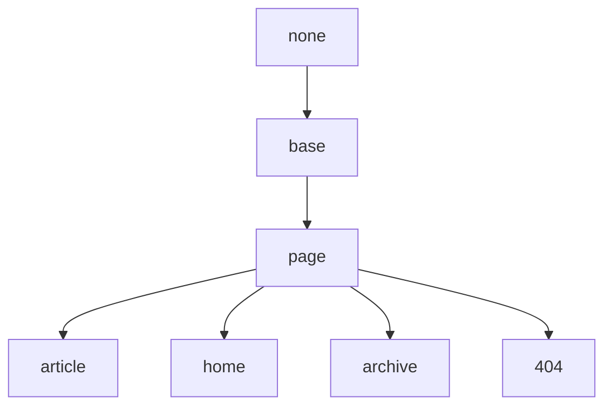

## Base Layout

Base on none.

## Page Layout

Base on Base Layout.

| Variable          | Option Values         | Description |
| ---               | ---                   | ---         |
| **key**           | -                     | Unique key for the post, required by Comment and Pageviews. begin with a letter (`[A-Za-z]`) and may be followed by any number of letters, digits (`[0-9]`), hyphens (`-`), underscores (`_`), colons (`:`), and periods (`.`)|
| **show_title**    | true(default), false  | Set as false to hide title on this page|
| **comment**       | true(default), false  | Set as `false` to disable comment on this page|
| **mathjax**       | true, false(default)  | Set as `true` to enable Mathjax on this page|
| **mathjax_autoNumber** | true, false(default)  | Set as `true` to enable Mathjax autoNumber on this page|
| **mermaid**       | true, false(default)  | Set as `true` to enable Mermaid on this page|
| **chart**         | true, false(default)  | Set as `true` to enable Chart on this page|
| **sidebar**       | -                     | |
| **aside**         | -                     | |

## Article Layout

Base on Page Layout.

| Variable          | Option Values         | Description |
| **modify_date**   | -                     | The last modified date of this article, the date is modified in the format `YYYY-MM-DD HH:MM:SS +/-TTTT`; hours, minutes, seconds, and timezone offset are optional. just like `date` variable |

## Home Layout

Base on Page Layout.

## Archive Layout

Base on Page Layout.

## 404 Layout

Base on Page Layout.