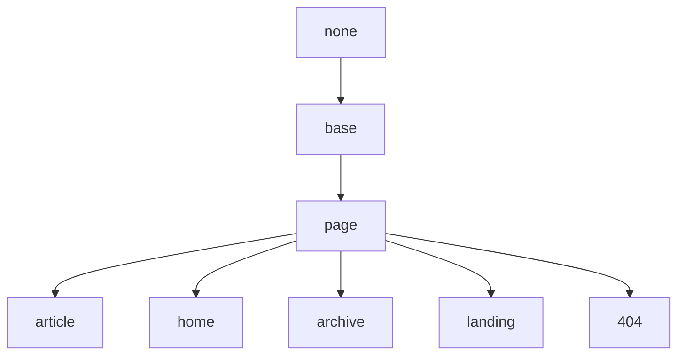

## Base Layout

Base on None.

## Page Layout

Base on Base Layout.

| Variable          | Option Values         | Description |
| ---               | ---                   | ---         |
| **type**          | webpage (default), article | type of the page, used by [schema.org](https://schema.org/) markup |
| **key**           | -                     | Unique key for the post, required by Comments and Pageview. begin with a letter (`[A-Za-z]`) and may be followed by any number of letters, digits (`[0-9]`), hyphens (`-`), underscores (`_`), colons (`:`), and periods (`.`) |
| **lang**          | en                    | Language of this page |
| **show_header**   | true (default), false | Set as `false` to hide header on this page |
| **show_title**    | true (default), false | Set as `false` to hide title on this page |
| **show_edit_on_github** | true, false (default) | Set as `true` to show “Edit on Github” button. you need set `repository` and `repository_tree` in *_config.yml* first |
| **full_width**    | true, false (default) | Set as `true` to make main full width on this page |
| **comment**       | true (default), false | Set as `false` to disable comment on this page |
| **mathjax**       | true, false (default) | Set as `true` to enable Mathjax on this page |
| **mathjax_autoNumber** | true, false (default) | Set as `true` to enable Mathjax autoNumber on this page |
| **mermaid**       | true, false (default) | Set as `true` to enable Mermaid on this page |
| **chart**         | true, false (default) | Set as `true` to enable Chart on this page|
| **sidebar**       | -                     | |
| **aside**         | -                     | |

## Article Layout

Base on Page Layout.

| Variable          | Option Values         | Description |
| **modify_date**   | -                     | The last modified date of this article, the date is modified in the format `YYYY-MM-DD HH:MM:SS +/-TTTT`; hours, minutes, seconds, and timezone offset are optional. just like `date` variable |
| **author** | - | Assign one of the authors in *authors.yml* to a post or page, see [Authors](https://tianqi.name/jekyll-TeXt-theme/docs/en/authors) for detail |
| **show_author_profile** | true, false (default) | Set as `true` to show author profile at the beginning of the article |
| **license**       | true, false, "CC-BY-4.0", "CC-BY-SA-4.0", "CC-BY-NC-4.0", "CC-BY-ND-4.0" | license of the article. Set true to use `license` variable setted in *_config.yml*, set false to enable it |

## Home Layout

Base on Page Layout.

## Archive Layout

Base on Page Layout.

## Landing Layout

Base on Page Layout.

## 404 Layout

Base on Page Layout.