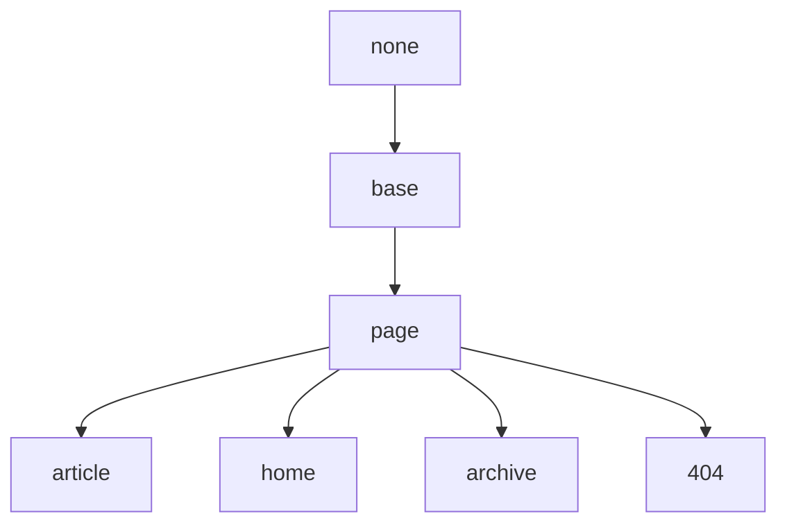

## Base 布局

继承于 none.

## Page 布局

继承于 Base 布局.

| Variable          | Option Values         | Description |
| ---               | ---                   | ---         |
| **key**           | -                     | 页面的唯一标识符，供评给评论系统和点击量统计使用。必须以字母（`[A-Za-z]`）开头，其后可以接若干字母、数字（`[0-9]`）、连字符（`-`）、下划线（`_`）、冒号（`:`）和小数点（`.`） |
| **lang**          | en                    | 该页的语言 |
| **show_title**    | true(default), false  | 该页是否显示标题，默认显示，设置为 `false` 隐藏 |
| **modify_date**   | -                     | 该文章的最后修改时间, 其格式为 `YYYY-MM-DD HH:MM:SS +/-TTTT` 和 `date` 的格式相同 |
| **comment**       | true(default), false  | 该页是否开启评论支持，默认开启，设置为 `false` 关闭 |
| **mathjax**       | true, false(default)  | 该页是否开启 Mathjax 公式支持，默认关闭，设置为 `true` 开启 |
| **mathjax_autoNumber** | true, false(default)  | 该页的 Mathjax 公式是否自动编号，默认关闭，设置为 `true` 开启 |
| **mermaid**       | true, false(default)  | 该页是否开启 Mermaid 流程图支持，默认关闭，设置为 `true` 开启 |
| **chart**         | true, false(default)  | 该页是否开启 Chart 图表支持，默认关闭，设置为 `true` 开启 |
| **sidebar**       | -                     | |
| **aside**         | -                     | |

## Article 布局

继承于 Page 布局.

| Variable          | Option Values         | Description |
| **modify_date**   | -                     | 该文章的最后修改时间, 其格式为 `YYYY-MM-DD HH:MM:SS +/-TTTT` 和 `date` 的格式相同 |

## Home 布局

继承于 Page 布局.

## Archive 布局

继承于 Page 布局.

## 404 布局

继承于 Page 布局.