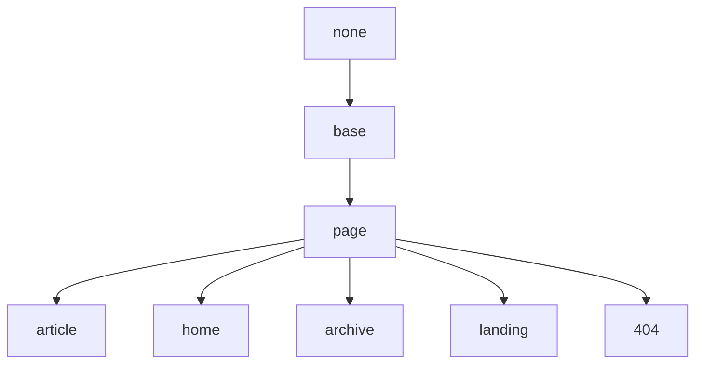

## Base 布局

继承于 None。

## Page 布局

继承于 Base 布局。

| Variable          | Option Values         | Description |
| ---               | ---                   | ---         |
| **type**          | webpage (default), article | 该页的类型, 作为 [schema.org](https://schema.org/) 的语义化标记使用 |
| **key**           | -                     | 页面的唯一标识符，供评论系统和点击量统计使用。必须以字母（`[A-Za-z]`）开头，其后可以接若干字母、数字（`[0-9]`）、连字符（`-`）、下划线（`_`）、冒号（`:`）和小数点（`.`） |
| **lang**          | en                    | 该页的语言 |
| **show_header**   | true (default), false | 该页是否显示 Header， 设置为 `false` 隐藏 |
| **show_title**    | true (default), false | 该页是否显示标题，默认显示，设置为 `false` 隐藏 |
| **show_edit_on_github** | true, false (default) | 该页是否显示“在 Github 上修改”按钮，设置为 `true` 显示。你需要先在 *_config.yml* 中设置 `repository` 和 `repository_tree` |
| **full_width**    | true, false (default) | 该页内容是否占据全部宽度，设置为 `true` 开启 |
| **comment**       | true (default), false | 该页是否开启评论支持，默认开启，设置为 `false` 关闭 |
| **mathjax**       | true, false (default) | 该页是否开启 Mathjax 公式支持，默认关闭，设置为 `true` 开启 |
| **mathjax_autoNumber** | true, false (default) | 该页的 Mathjax 公式是否自动编号，默认关闭，设置为 `true` 开启 |
| **mermaid**       | true, false (default) | 该页是否开启 Mermaid 流程图支持，默认关闭，设置为 `true` 开启 |
| **chart**         | true, false (default) | 该页是否开启 Chart 图表支持，默认关闭，设置为 `true` 开启 |
| **sidebar**       | -                     | |
| **aside**         | -                     | |

## Article 布局

继承于 Page 布局。

| Variable          | Option Values         | Description |
| **modify_date**   | -                     | 该文章的最后修改时间, 其格式为 `YYYY-MM-DD HH:MM:SS +/-TTTT` 和 `date` 的格式相同 |
| **author** | - | 将在 *authors.yml* 中定义的作者作为某篇文章或页面的作者, 详情请看[作者](https://tianqi.name/jekyll-TeXt-theme/docs/zh/authors) |
| **show_author_profile** | true, false (default) | 是否在文章开头显示作者信息卡片，设置为 `true` 显示 |
| **license**       | true, false, "CC-BY-4.0", "CC-BY-SA-4.0", "CC-BY-NC-4.0", "CC-BY-ND-4.0" | 该文章的许可协议。设置为 `true` 使用在 *_config.yml* 中设置的 `license` 值，设置为 `false` 不使用许可协议 |

## Home 布局

继承于 Page 布局。

## Archive 布局

继承于 Page 布局。

## Landing 布局

继承于 Page 布局。

## 404 布局

继承于 Page 布局。