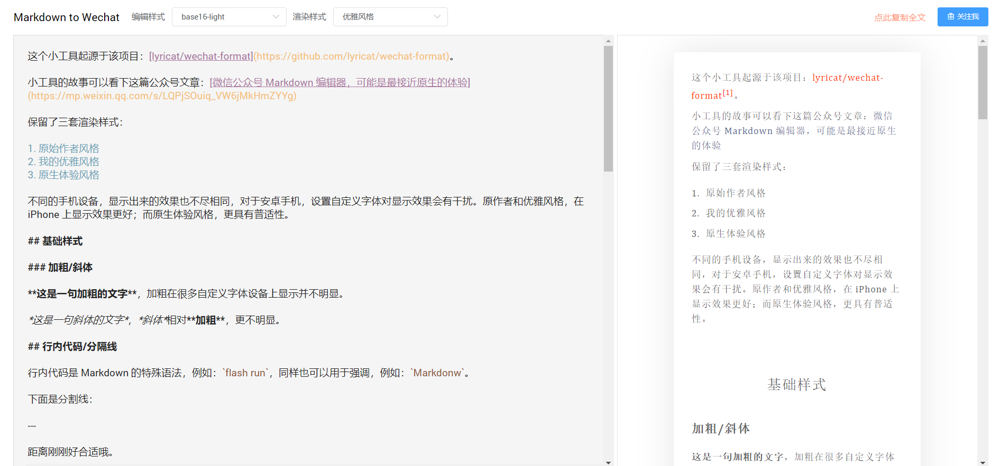

这里记录我做的一些小产品。

### Kindle2flomo

近期在做的一款工具产品，结合 flomo 的笔记服务，实现将 Kindle 读书笔记一键导入到 flomo 中，产品的形态已经经过两个版本的迭代，但我仍然觉得这不是最终形态，即便是一个简单的工具产品，也应该具备更好的产品体验，帮助到更多的人，实现它的价值。

做这个小工具的一些记录：

- [详谈 Kindle 读书笔记的导出](http://mp.weixin.qq.com/s?__biz=MjM5MDQ4NjUwMg==&mid=2649198191&idx=1&sn=95c506dde4a079d2840a91b12ca358a8&chksm=be5734e68920bdf04af5ad5f31d8c40acea17e723b1b0eeaa2d3d47d009a0adc5abca44bc953#rd)
- [Kindle 笔记一键导入 Flomo](http://mp.weixin.qq.com/s?__biz=MjM5MDQ4NjUwMg==&mid=2649198220&idx=1&sn=5d0fecf4d3a4ab1469724292dad9797d&chksm=be5734058920bd13ac17f149d7a54dd01b17a066d70f55a813ebb338075b6837f6c6605b255b#rd)
- [聊一点 kindle2flomo 技术相关的东西吧](http://mp.weixin.qq.com/s?__biz=MjM5MDQ4NjUwMg==&mid=2649198238&idx=1&sn=31d5111d4a3bdc65ab1283612f1427f1&chksm=be5734178920bd0117a068f2c73897fd05c37bddba78efd62ccdf2bb6df5a0386172a4499143#rd)
- [kindle2flomo 2.0 帮助你提高写读书笔记的效率](https://mp.weixin.qq.com/s?__biz=MjM5MDQ4NjUwMg==&mid=2649198375&idx=1&sn=7e50878c8e7046293a84b64bdec89918&chksm=be5735ae8920bcb87a66306af0038d29d265750d13136ce067887e129edf9c95051d509cc4d5&token=1584174037&lang=zh_CN#rd)
- [kindle2flomo 更新一二事，适配移动端](https://mp.weixin.qq.com/s?__biz=MjM5MDQ4NjUwMg==&mid=2649198414&idx=1&sn=33fd4821387b8ad50190cef56de5d38d&chksm=be5735c78920bcd13e4f18262d5f0853b979ba4744f4ffed565b366ca4ebf28042ef88d280e6&token=1584174037&lang=zh_CN#rd)

### MD2Wechat

这是一款针对微信公众号发文的 Markdown 在线编辑器。

很早之前根据一个开源项目改的，前段时间因为某些原因又拿出来完善了一下，顺便加了图床的功能，为了满足自己发公众号的需求。

后续应该还会有迭代。

关于它的几篇记录：

- [为了用 Markdown 写微信公众号，自定义了一个编辑器](https://mp.weixin.qq.com/s?__biz=MjM5MDQ4NjUwMg==&mid=2649197117&idx=1&sn=90616fd84e3a34bb9dc98dbbf27ee565&chksm=be5730b48920b9a25d4ddf9f2dd87bbcc61045d7bd160b4c7da0ae2c474d7cc91ca98732c340&token=2051922549&lang=zh_CN#rd)

- [微信公众号 Markdown 编辑器，可能是最接近原生的体验](https://mp.weixin.qq.com/s?__biz=MjM5MDQ4NjUwMg==&mid=2649198509&idx=1&sn=dc73a7bce4836d6648d7a4f8c8f0ff49&chksm=be5735248920bc322774cd6bce06bcc8553aa67c0b4745a40170762eed3704e0e1603f61bb14&token=1584174037&lang=zh_CN#rd)
